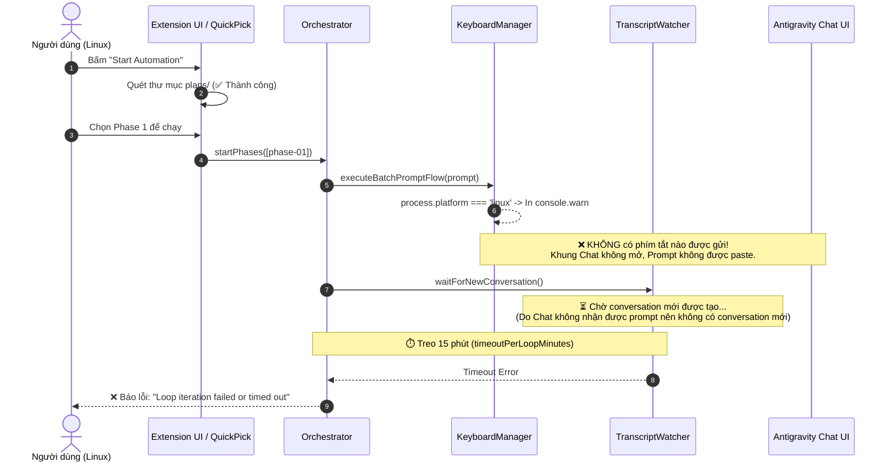

# Báo cáo Đánh giá Khả năng Hoạt động của Auto-Plan Extension trên Linux

---

## 1. Kết luận Trọng tâm

> **KHÔNG HOẠT ĐỘNG ĐƯỢC TRÊN LINUX (VÀ macOS).**
> 
> Hiện tại, extension `Auto-plan-Extension-main` **chỉ hỗ trợ duy nhất hệ điều hành Windows**. Khi cài đặt và chạy trên Linux, giao diện UI và bộ quét file vẫn hiển thị bình thường, nhưng **tiến trình tự động gửi Prompt vào khung chat sẽ bị tê liệt hoàn toàn**, dẫn đến việc extension chờ vô hạn hoặc báo lỗi **Timeout** sau 15 phút.

---

## 2. Phân tích Chi tiết Nguyên nhân Kỹ thuật

### 🔴 2.1. Điểm nghẽn cốt lõi: `src/keyboardManager.ts` bị khóa cứng cho Windows

Extension này điều khiển Antigravity IDE bằng cách mô phỏng tổ hợp phím hệ điều hành (`Ctrl+Shift+L` ➔ `Ctrl+A` ➔ `Ctrl+V` ➔ `Enter`). Tuy nhiên, cơ chế này được viết phụ thuộc 100% vào **PowerShell và Windows Script Host (COM Object)**.

#### A. Phân tích hàm `sendKeys()` (Dòng 180 - 199)
```typescript
// Trích xuất từ src/keyboardManager.ts
public async sendKeys(keys: string): Promise<void> {
  if (this.options.customKeySender) {
    await this.options.customKeySender(keys);
    return;
  }

  if (process.platform === 'win32') {
    try {
      // Dùng PowerShell COM Object WScript.Shell (Chỉ có trên Windows)
      const psCommand = `powershell -NoProfile -NonInteractive -Command "(New-Object -ComObject wscript.shell).SendKeys('${keys}')"`;
      await execAsync(psCommand);
    } catch {
      // Fallback: .NET Windows Forms SendKeys (Chỉ có trên Windows)
      const formsCommand = `powershell -NoProfile -NonInteractive -Command "Add-Type -AssemblyName System.Windows.Forms; [System.Windows.Forms.SendKeys]::SendWait('${keys}')"`;
      await execAsync(formsCommand);
    }
  } else {
    // Trên Linux/macOS: Chỉ in cảnh báo ra console và KHÔNG LÀM GÌ CẢ!
    console.warn(`KeyboardManager: sendKeys('${keys}') called on non-Windows platform: ${process.platform}`);
  }
}
```

#### B. Phân tích hàm `executeBatchPromptFlow()` (Dòng 284 - 298)
Khi Orchestrator bắt đầu chạy một Phase, nó gọi `executeBatchPromptFlow()` để gửi prompt:
```typescript
// Trích xuất từ src/keyboardManager.ts
// 5. Native OS Execution (Windows single PowerShell process)
if (process.platform === 'win32') {
  try {
    const psCommand = `powershell -NoProfile -NonInteractive -Command "${batchScript}"`;
    await execAsync(psCommand);
  } catch {
    const formsScript = this.buildFormsBatchScript(options);
    const formsCommand = `powershell -NoProfile -NonInteractive -Command "${formsScript}"`;
    await execAsync(formsCommand);
  }
} else {
  // Trên Linux: Không chạy bất kỳ script nào
  console.warn(`KeyboardManager: executeBatchPromptFlow called on non-Windows platform: ${process.platform}`);
}
```

#### C. Hàm fallback Clipboard `copyToClipboard()` (Dòng 85 - 95)
Nếu `vscode.env.clipboard.writeText` gặp trục trặc, hàm fallback tiếp tục gọi `powershell ... Set-Clipboard`, lệnh này không khả dụng trên môi trường Linux chuẩn.

---

## 3. Diễn biến Thực tế khi Chạy Extension trên Linux

Nếu bạn cài đặt file `.vsix` vào Antigravity IDE trên Linux và bấm chạy, kịch bản sau sẽ xảy ra:



1. **Bước 1 (Giao diện)**: Giao diện QuickPick mở lên, Status Bar hiển thị biểu tượng tên lửa, danh sách các file plan trong `plans/` được liệt kê chính xác (do Node.js `fs` và `path` trên Linux hoạt động tốt).
2. **Bước 2 (Gửi Prompt)**: Status bar chuyển sang `$(sync~spin) Auto-Plan: [1/N] Phase 1: Sending prompt...`.
3. **Bước 3 (Thất bại âm thầm)**: `KeyboardManager` phát hiện `process.platform === 'linux'`, bỏ qua việc gửi phím `Ctrl+Shift+L`, `Ctrl+V`, `Enter` và chỉ ghi log cảnh báo ngầm. Cửa sổ chat của Antigravity IDE hoàn toàn đứng yên, không có nội dung nào được nhập vào.
4. **Bước 4 (Treo và Báo lỗi)**: `TranscriptWatcher` bắt đầu lắng nghe thư mục `~/.gemini/antigravity-ide/brain` để chờ file transcript mới. Do không có prompt nào được gửi đi, AI không phản hồi và không có log mới. Sau **15 phút** (hết thời gian `timeoutPerLoopMinutes`), extension văng lỗi **Timeout Error** và dừng hoạt động.

---

## 4. Đánh giá Mức độ Tương thích của Từng Thành phần

| Thành phần / File | Trạng thái trên Linux | Chi tiết kỹ thuật |
| :--- | :---: | :--- |
| **Giao diện & Command (`extension.ts`)** | ✅ Tốt | Sử dụng hoàn toàn VS Code Extension API (`QuickPick`, `StatusBarItem`). |
| **Cấu hình (`config.ts`)** | ✅ Tốt | Đọc ghi cấu hình qua `vscode.workspace.getConfiguration`. |
| **Quét File Plan (`planScanner.ts`)** | ✅ Tốt | Đã chuẩn hóa đường dẫn forward-slash (`/`), tương thích hoàn toàn POSIX Linux. |
| **Theo dõi Log AI (`transcriptWatcher.ts`)** | ✅ Tốt | Đường dẫn `getDefaultBrainDir()` sử dụng `os.homedir()` trỏ chính xác về `/home/<user>/.gemini/antigravity-ide/brain`. |
| **Gửi Phím & Nhập Prompt (`keyboardManager.ts`)** | ❌ **Liệt hoàn toàn** | Phụ thuộc hoàn toàn vào PowerShell (`WScript.Shell`, `.NET SendKeys`). Thiếu hoàn toàn adapter cho Linux (X11 / Wayland). |

---

## 5. Giải pháp để Auto-Plan Hoạt động trên Linux

Để `Auto-Plan Extension` có thể chạy trơn tru trên Linux, có 2 phương án xử lý:

### 🟢 Phương án 1: Triển khai DOM Renderer Bridge (Khuyến nghị cao nhất)
*(Đây chính là giải pháp đang được thiết kế tại kế hoạch `plans/260829-0952-focus-free-dom-bridge` trong dự án)*

- **Cách thức**: Inject một script nhỏ vào `workbench.html` của Antigravity IDE. Extension gửi lệnh qua HTTP Server nội bộ / WebSocket trực tiếp tới DOM của khung Chat.
- **Ưu điểm**:
  - ✅ **Hoạt động 100% trên cả Linux, macOS và Windows**.
  - ✅ **Chạy ngầm hoàn toàn (Focus-free)**: Người dùng có thể thoải mái lướt web, mở tab khác mà không lo bị chiếm phím hay gửi nhầm phím.
  - ✅ Không cần cài thêm bất kỳ gói hệ điều hành nào.

---

### 🟡 Phương án 2: Bổ sung Linux CLI Keyboard Adapter (Giải pháp tạm thời)
Nếu vẫn muốn giữ cơ chế giả lập phím bấm OS:

1. **Trên Linux X11**: Tích hợp gọi tiện ích `xdotool`:
   ```bash
   # Mở chat, dán và gửi
   xdotool key ctrl+shift+l
   sleep 0.8
   xdotool key ctrl+a
   xdotool key ctrl+v
   xdotool key Return
   ```
2. **Trên Linux Wayland**: Tích hợp `ydotool` hoặc `wtype`.
3. **Nhược điểm**: 
   - Yêu cầu người dùng Linux phải cài đặt thủ công `sudo apt install xdotool` (hoặc `ydotool`).
   - Vẫn dính nhược điểm lớn: Bắt buộc cửa sổ IDE phải đang được Focus; nếu người dùng đang lướt web sẽ bị gõ nhầm vào trình duyệt.

---

## 6. Tổng kết

- Hiện tại mã nguồn `Auto-plan-Extension-main` **CHƯA THỂ CHẠY ĐƯỢC TRÊN LINUX**.
- Để sử dụng được trên Linux, cần hoàn thiện việc nâng cấp kiến trúc sang **DOM Renderer Bridge** (theo kế hoạch `plans/260829-0952-focus-free-dom-bridge`) để thay thế hoàn toàn module `keyboardManager.ts` cũ dùng PowerShell.
