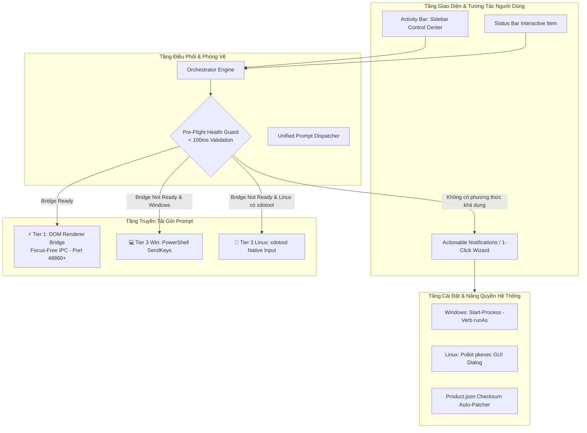

# Kế Hoạch Kỹ Thuật Chi Tiết: Nâng Cấp Auto-Plan Extension Hỗ Trợ Đa Nền Tảng (Windows & Linux) & Tối Ưu Hóa Đột Phá UI/UX

---

## 📑 Mục lục
1. [Tổng quan & Mục tiêu Dự án](#1-tổng-quan--mục-tiêu-dự-án)
2. [Kiến trúc Kỹ thuật Toàn diện](#2-kiến-trúc-kỹ-thuật-toàn-diện)
3. [Chi tiết Các Module Nâng cấp Cốt lõi](#3-chi-tiết-các-module-nâng-cấp-cốt-lõi)
   - [3.1. Nâng quyền Đồ họa Tự động (Cross-Platform GUI Elevation)](#31-nâng-quyền-đồ-họa-tự-động-cross-platform-gui-elevation)
   - [3.2. Chống Treo & Pre-Flight Validation (Fail-Fast Guard)](#32-chống-treo--pre-flight-validation-fail-fast-guard)
   - [3.3. Bổ sung Linux Native Keyboard Fallback (`xdotool`)](#33-bổ-sung-linux-native-keyboard-fallback-xdotool)
   - [3.4. Bảng điều khiển Sidebar Webview (Sidebar Control Center)](#34-bảng-điều-khiển-sidebar-webview-sidebar-control-center)
   - [3.5. Hệ thống Thông báo Đi kèm Hành động (Actionable Notifications)](#35-hệ-thống-thông-báo-đi-kèm-hành-động-actionable-notifications)
4. [Lộ trình Triển khai Chi tiết (Phased Implementation Plan)](#4-lộ-trình-triển-khai-chi-tiết-phased-implementation-plan)
5. [Đặc tả Mã nguồn & Cấu trúc File](#5-đặc-tả-mã-nguồn--cấu-trúc-file)
6. [Kịch bản Kiểm thử & Tiêu chí Nghiệm thu (Acceptance Criteria)](#6-kịch-bản-kiểm-thử--tiêu-chí-nghiệm-thu-acceptance-criteria)

---

## 1. Tổng quan & Mục tiêu Dự án

### 🎯 Mục tiêu Trọng tâm:
1. **Hỗ trợ 100% hai hệ điều hành: Windows & Linux** (bỏ qua macOS):
   - Đảm bảo tính năng gửi prompt tự động và focus-free hoạt động tương đương 100% trên cả hai môi trường.
2. **Loại bỏ hoàn toàn rào cản kỹ thuật cho Người dùng cuối (Zero-Terminal Experience)**:
   - Không bắt người dùng phải mở Terminal gõ `sudo chown` hay chạy IDE dưới quyền Administrator.
   - Cài đặt và kích hoạt chỉ bằng **1-Click** thông qua hộp thoại phân quyền đồ họa của hệ điều hành (Polkit trên Linux, UAC trên Windows).
3. **Triệt tiêu hoàn toàn tình trạng treo máy 15 phút (Zero-Timeout Fail-Fast)**:
   - Phát hiện lỗi thiếu Bridge hoặc thiếu công cụ gửi phím trong **< 100ms**, dừng tiến trình ngay lập tức và mở giao diện hướng dẫn giải quyết.
4. **Nâng cấp Giao diện Đồ họa Đỉnh cao (Sidebar Control Center)**:
   - Xây dựng bảng điều khiển hiện đại tích hợp trên Activity Bar của IDE: hiển thị tiến độ trực quan, danh sách phase dạng checkbox, nút bấm điều khiển lớn (Start/Pause/Skip/Stop), và Live AI Activity Feed.

---

## 2. Kiến trúc Kỹ thuật Toàn diện



---

## 3. Chi tiết Các Module Nâng cấp Cốt lõi

### 3.1. Nâng quyền Đồ họa Tự động (Cross-Platform GUI Elevation)
- **Vị trí file:** `src/workbenchInjector.ts`
- **Mục đích:** Ghi mã script chèn vào `workbench.html` và cập nhật checksums trong `product.json` khi IDE nằm trong thư mục được bảo vệ của hệ thống.
- **Cơ chế triển khai:**
  - **Trên Linux:** Sử dụng `pkexec` để kích hoạt cửa sổ nhập mật khẩu đồ họa chuẩn của desktop Linux (GNOME/KDE/XFCE):
    ```bash
    pkexec bash -c "cp '<tmp>' '<workbench.html>' && chmod 644 '<workbench.html>'"
    ```
  - **Trên Windows:** Khi IDE cài đặt trong `C:\Program Files\...`, sử dụng PowerShell lệnh nâng quyền UAC chuẩn của Windows:
    ```powershell
    Start-Process powershell -Verb runAs -ArgumentList '-NoProfile -NonInteractive -Command Copy-Item -Path \"<tmp>\" -Destination \"<workbench.html>\" -Force'
    ```
  - **Tự động vá Checksum:** Quét file `product.json`, băm SHA256 lại các file đã sửa đổi để ngăn chặn thông báo *"Your Code installation appears to be corrupt"*.

---

### 3.2. Chống Treo & Pre-Flight Validation (Fail-Fast Guard)
- **Vị trí file:** `src/promptDispatcher.ts` & `src/orchestrator.ts`
- **Mục đích:** Tuyệt đối không để xảy ra trường hợp bấm Start xong extension đứng im 15 phút vì không gửi được phím.
- **Thuật toán Pre-Flight Check:**
  1. Khi người dùng bấm `Start Automation`:
  2. Kiểm tra `BridgeServer.getConnectedClients().length > 0`:
     - Nếu `> 0`: ✅ Trả về `domBridge` sẵn sàng, kích hoạt chế độ Focus-Free.
  3. Nếu DOM Bridge chưa kết nối:
     - **Trên Windows:** Kiểm tra PowerShell có sẵn ➔ Chấp nhận Tier 3 (PowerShell) kèm cảnh báo cần giữ focus.
     - **Trên Linux:** Kiểm tra xem hệ thống có lệnh `xdotool` không (`execSync('which xdotool')`):
       - Nếu có `xdotool`: ✅ Chấp nhận Tier 3 (Linux `xdotool`) kèm cảnh báo cần giữ focus.
       - Nếu **không có `xdotool`**: 🛑 **DỪNG NGAY LẬP TỨC TRONG 0.1 GIÂY**, hủy tiến trình và mở thông báo trợ giúp 1-Click Setup.

---

### 3.3. Bổ sung Linux Native Keyboard Fallback (`xdotool`)
- **Vị trí file:** `src/keyboardManager.ts`
- **Mục đích:** Cung cấp phương án dự phòng bàn phím trên Linux trong trường hợp người dùng chưa muốn inject DOM Bridge.
- **Kịch bản thực thi trên Linux:**
  ```typescript
  // Trình tự gửi phím mô phỏng trên Linux X11/Wayland
  public async executeLinuxBatchPrompt(promptText: string, options?: BatchPromptOptions): Promise<void> {
    await this.copyToClipboard(promptText);
    const focusDelay = (options?.focusDelayMs ?? 800) / 1000;
    const cmd = [
      `xdotool key --clearmodifiers ctrl+shift+l`,
      `sleep ${focusDelay}`,
      `xdotool key --clearmodifiers ctrl+a`,
      `sleep 0.1`,
      `xdotool key --clearmodifiers ctrl+v`,
      `sleep 0.2`,
      `xdotool key --clearmodifiers Return`
    ].join(' && ');
    await execAsync(cmd);
  }
  ```

---

### 3.4. Bảng điều khiển Sidebar Webview (Sidebar Control Center)
- **Vị trí file:** `src/sidebarProvider.ts` (mới) & `media/sidebar/`
- **Giao diện & Tính năng:**
  1. **Header Trạng thái Kết nối:**
     - 🟢 `DOM Bridge: Đã kết nối (Focus-Free)` hoặc 🟡 `Keyboard Fallback` hoặc 🔴 `Chưa kích hoạt Bridge`.
  2. **Thư mục Plan & Bộ lọc Phase:**
     - Dropdown chọn Folder Plan trong workspace.
     - Danh sách Phase hiển thị dạng Checkbox trực quan với màu sắc trạng thái (Xanh: Đã hoàn thành, Vàng: Đang chạy, Xám: Đang chờ, Đỏ: Lỗi).
     - Hiển thị thời gian thực thi của từng Phase.
  3. **Bộ Nút Điều Khiển Chính:**
     - Nút `[ ▶️ Chạy các Phase đã chọn ]`
     - Nút `[ ⏸️ Tạm dừng ]` / `[ ⏭️ Bỏ qua Phase ]` / `[ ⏹️ Dừng hẳn ]`
  4. **Khung Live AI Output (Thời gian thực):**
     - Theo dõi file transcript và trích xuất 3 dòng thông tin mới nhất từ phản hồi của AI để người dùng nắm được AI đang làm gì.
  5. **Nút 1-Click Fix & Cài đặt Nhanh:**
     - Nút `[ ⚡ Kích hoạt / Cập nhật DOM Bridge ]`
     - Toggle `Tự động phê duyệt quyền (Allow / Run / Submit)`

---

### 3.5. Hệ thống Thông báo Đi kèm Hành động (Actionable Notifications)
- **Vị trí file:** `src/extension.ts`
- Mọi cảnh báo hay thông báo lỗi đều phải đi kèm ít nhất một nút giải quyết trực tiếp:
  - Thông báo khi DOM Bridge chưa cài:
    `[ ⚡ Kích hoạt Tự động (1-Click) ]` | `[ 🛠️ Mở Chẩn đoán ]` | `[ Bỏ qua ]`
  - Thông báo sau khi cài đặt xong:
    `[ 🔄 Khởi động lại IDE ngay ]` | `[ Để sau ]`
  - Thông báo khi xảy ra lỗi Pre-Flight trên Linux:
    `[ ⚡ Kích hoạt DOM Bridge ngay ]` | `[ 📦 Xem lệnh cài xdotool ]`

---

## 4. Lộ trình Triển khai Chi tiết (Phased Implementation Plan)

### 🚀 Phase 1: Nâng cấp Nâng quyền Đa Nền tảng & Linux Keyboard Adapter
- [ ] Cập nhật hàm `writeFileElevated()` trong `src/workbenchInjector.ts` hỗ trợ `pkexec` (Linux) và PowerShell UAC `Start-Process -Verb runAs` (Windows).
- [ ] Cập nhật hàm `executeBatchPromptFlow()` trong `src/keyboardManager.ts` hỗ trợ lệnh `xdotool` trên Linux.
- [ ] Bổ sung hàm `checkLinuxKeyboardPrerequisites()` để kiểm tra sự tồn tại của `xdotool`.

### 🚀 Phase 2: Nâng cấp Pre-Flight Guard & Tối ưu hóa Dispatcher
- [ ] Thêm phương thức `validateDispatchReadiness()` trong `src/promptDispatcher.ts`.
- [ ] Tích hợp Pre-flight Check vào `orchestrator.startPhases()` để ngắt ngay lập tức nếu không đủ điều kiện, mở hộp thoại Actionable Dialog.
- [ ] Loại bỏ thông báo cảnh báo thụ động gây hiểu lầm; thay bằng cảnh báo có nút bấm giải quyết tức thì.

### 🚀 Phase 3: Xây dựng Sidebar Control Center (Webview View Provider)
- [ ] Tạo file `src/sidebarProvider.ts` hiện thực giao diện `vscode.WebviewViewProvider`.
- [ ] Thiết kế giao diện HTML/CSS/JS hiện đại trong `media/sidebar/` (Hỗ trợ Dark Theme chuẩn Antigravity/VS Code, Glassmorphism, Micro-animations).
- [ ] Thiết lập kênh giao tiếp 2 chiều (Message Passing) giữa Extension Host và Sidebar Webview (Gửi lệnh Start/Pause/Skip/Stop, cập nhật trạng thái Phase, Live log).

### 🚀 Phase 4: Đăng ký Contribution & Tích hợp Hệ thống
- [ ] Cập nhật `package.json`:
  - Khai báo `viewsContainers.activitybar` với icon tên lửa Auto-Plan.
  - Khai báo `views` trỏ tới Sidebar Webview View ID `autoplan.sidebarView`.
  - Đăng ký các command mở rộng: `autoplan.openSidebar`, `autoplan.oneClickSetup`.
- [ ] Cập nhật `src/extension.ts` để khởi tạo `SidebarProvider` và liên kết sự kiện từ `orchestrator`.

### 🚀 Phase 5: Kiểm thử Đa Nền tảng & Đóng gói Bản phát hành
- [ ] Chạy Test Suite kiểm thử trên môi trường Linux (Ubuntu/Debian) và Windows 10/11.
- [ ] Kiểm tra trường hợp chạy ngầm khi người dùng lướt web (Focus-Free Verification).
- [ ] Đóng gói file cài đặt `antigravity-auto-plan-1.1.0.vsix`.

---

## 5. Đặc tả Mã nguồn & Cấu trúc File

### 📁 Cấu trúc Thư mục sau Nâng cấp:
```text
Auto-plan-Extension-main/
├── media/
│   ├── autoplan-dom-bridge.js      # Script inject vào workbench.html
│   ├── icon.svg                     # Icon tên lửa cho Activity Bar
│   └── sidebar/
│       ├── sidebar.css              # Giao diện hiện đại cho Sidebar Dashboard
│       ├── sidebar.js               # Logic tương tác Webview
│       └── sidebar.html             # Template khung điều khiển
├── src/
│   ├── bridgeServer.ts              # Local HTTP IPC Server
│   ├── config.ts                    # Đọc/ghi cấu hình extension
│   ├── extension.ts                 # Điểm kích hoạt chính của extension
│   ├── keyboardManager.ts           # Trình gửi phím OS (PowerShell Win + xdotool Linux)
│   ├── orchestrator.ts              # Động cơ điều phối vòng lặp và xử lý phase
│   ├── planScanner.ts               # Quét và sắp xếp các file phase markdown
│   ├── promptDispatcher.ts          # Bộ điều phối gửi prompt 3 tầng & Pre-flight check
│   ├── sidebarProvider.ts           # [MỚI] Webview View Provider cho Sidebar UI
│   ├── transcriptWatcher.ts         # Theo dõi file transcript AI
│   └── workbenchInjector.ts         # Quản lý inject script & nâng quyền UAC / Polkit
├── package.json
└── tsconfig.json
```

---

## 6. Kịch bản Kiểm thử & Tiêu chí Nghiệm thu (Acceptance Criteria)

| STT | Kịch bản Kiểm thử (Test Case) | Môi trường | Kết quả Kỳ vọng (Expected Result) |
| :---: | :--- | :---: | :--- |
| **TC-01** | Cài đặt mới VSIX và bấm `1-Click Setup` | Linux | Xuất hiện hộp thoại Polkit nhập mật khẩu hệ thống; inject thành công vào `workbench.html`; hiện nút Reload Window. |
| **TC-02** | Cài đặt mới VSIX và bấm `1-Click Setup` | Windows | Xuất hiện hộp thoại UAC của Windows; inject thành công; không xuất hiện cảnh báo "Corrupted". |
| **TC-03** | Khởi động tự động hóa và chuyển sang lướt Chrome | Linux & Win | AI tự nhận prompt, tự sinh code và chuyển phase tiếp theo mà **không bị mất focus hay gửi nhầm phím vào Chrome**. |
| **TC-04** | Bấm Start khi chưa cài Bridge & Linux thiếu xdotool | Linux | Dừng ngay trong 0.1s; hiển thị modal thông báo kèm nút `[⚡ Kích hoạt DOM Bridge]` (Không bị treo 15 phút). |
| **TC-05** | Tương tác qua Sidebar Control Center | Linux & Win | Tích chọn 2 trong 5 phase; bấm Start; Sidebar cập nhật tiến độ real-time, nút Pause/Skip/Stop hoạt động chính xác. |

---

## 7. Kết luận

Kế hoạch kỹ thuật trên giải quyết triệt để tất cả các tồn đọng của phiên bản cũ:
1. **Xóa bỏ hoàn toàn lỗi không tương thích trên Linux**.
2. **Mang lại trải nghiệm người dùng mượt mà, tiện lợi, không cần can thiệp Terminal**.
3. **Trang bị giao diện Sidebar Dashboard chuyên nghiệp, biến Auto-Plan thành một công cụ tự động hóa hoàn chỉnh và cao cấp**.
