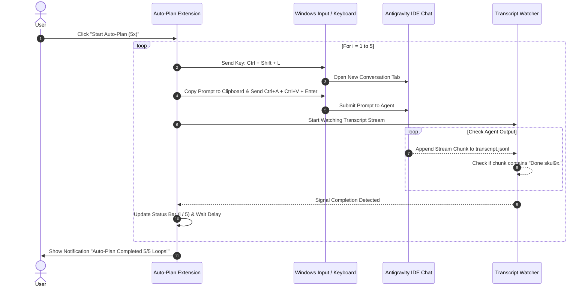

# Specification: Antigravity Auto-Plan Automation Extension

## 1. Executive Summary
- **Mục tiêu**: Tự động hóa quá trình gửi chuỗi tác vụ lặp lại (5 lần) trên Antigravity IDE thông qua phím tắt `Ctrl + Shift + L`, paste prompt và giám sát tín hiệu hoàn thành `Done skul9x.` qua Antigravity log transcript.
- **Hình thức phân phối**: VS Code Extension đóng gói `.vsix` cài trực tiếp vào Antigravity IDE.

---

## 2. Logic Flowchart (Mermaid)

---

## 3. Extension Configuration Schema

| Key | Type | Default | Description |
| :--- | :--- | :--- | :--- |
| `autoplan.promptText` | `string` | `"Hãy trả lời tôi với câu trả lời là \"Done skul9x.\", ngoài ra không nói gì thêm"` | Nội dung văn bản sẽ tự động paste vào khung chat |
| `autoplan.repeatCount` | `number` | `5` | Số lần lặp lại quy trình |
| `autoplan.completionKeyword` | `string` | `"Done skul9x."` | Từ khóa Agent trả về để báo hoàn thành |
| `autoplan.delayBetweenLoopsMs` | `number` | `2000` | Thời gian chờ (mili-giây) giữa các vòng lặp |
| `autoplan.timeoutPerLoopMinutes`| `number`| `15` | Giới hạn thời gian tối đa cho 1 lượt chạy |

---

## 4. Commands & User Interaction

1. `autoplan.start`:
   - Phím tắt đề xuất: Không bắt buộc (hoặc `Ctrl + Alt + A`).
   - Có thể click trực tiếp từ nút trên Status Bar `$(play) Auto-Plan (5x)`.
2. `autoplan.stop`:
   - Dừng khẩn cấp vòng lặp ngay lập tức và hủy mọi watcher.
3. `autoplan.setPrompt`:
   - Mở Input Box để nhập nhanh đoạn prompt mới mà không cần vào Settings JSON.
