# Báo Cáo Kiểm Toán Logic Toàn Diện: Antigravity Auto-Plan Extension

> **Phiên bản:** 4.0  
> **Phạm vi kiểm toán:** Toàn bộ codebase extension (`src/`, `media/`, scripts điều khiển)  
> **Tổng số file đã kiểm toán:** 15 files  
> **Tổng số lỗi logic phát hiện:** 15 lỗi  
> **Phân loại độ nghiêm trọng:**  
> - 🔴 **CRITICAL (Nghiêm trọng):** 3  
> - 🟠 **HIGH (Cao):** 4  
> - 🟡 **MEDIUM (Trung bình):** 5  
> - 🔵 **LOW (Thấp):** 3  

---

## 1. Đánh Giá Kiến Trúc Tổng Thể (Executive Architecture Assessment)

Antigravity Auto-Plan Extension được thiết kế với kiến trúc tự động hóa 3 tầng (3-tier automation engine) không sử dụng runtime dependencies bên ngoài:
1. **Tier 1 (Focus-Free DOM Bridge):** Nhúng trực tiếp script client vào `workbench.html` của Electron Renderer, giao tiếp thông qua Embedded REST HTTP Server nội bộ trên localhost (`48860–48900`), thao tác DOM và kích hoạt sự kiện submit.
2. **Tier 2 (Native Command API):** Gọi lệnh VS Code nội bộ (`antigravity.sendTextToChat`).
3. **Tier 3 (OS Keyboard Simulation):** Điều khiển bàn phím mức OS thông qua PowerShell (`win32`) hoặc `xdotool` (`linux`).
4. **Giám sát tiến độ AI:** Stream dữ liệu `transcript.jsonl` từ thư mục `~/.gemini/antigravity-ide/brain/<convId>` dựa trên byte-offset và fs polling.

### Nhận định Kiến trúc
Mặc dù hệ thống có thiết kế bao phủ rất tốt về mặt ý tưởng và tính năng, **tầng logic điều khiển luồng (control-flow), đồng bộ dữ liệu (data-flow) và xử lý bất đồng bộ (concurrency) đang tồn tại các lỗ hổng logic nghiêm trọng**:
- **Cơ chế Fallback thiếu tín hiệu hủy (Abort Protocol):** Khi Tier 1 hết hạn (timeout), hệ thống rơi xuống Tier 2/3 nhưng không hủy bỏ tiến trình DOM đang chạy ngầm, dẫn đến việc gửi lặp prompt 2 lần.
- **Race condition trong thuật toán Dynamic Arbitration của TranscriptWatcher:** Khi AI mất hơn 3 giây để phản hồi, cơ chế phân giải tự động chọn nhầm các cuộc hội thoại cũ đã hoàn thành trong quá khứ, reset offset về 0 và lập tức báo hoàn thành giả (false-positive completion) mà không thực thi phase.
- **Xung đột đa cửa sổ (Multi-Window Port Collision):** Client DOM bridge quét cổng tuần tự từ `48860` nên tất cả các cửa sổ VS Code mở cùng lúc đều kết nối nhầm vào cửa sổ đầu tiên.
- **Khóa Event Loop bằng execSync:** Cơ chế nâng quyền ghi đè file hệ thống (`writeFileElevated`) gọi lệnh đồng bộ `execSync` (`pkexec` / UAC) ngay trong luồng khởi động extension và sự kiện lưu cấu hình, gây treo hoàn toàn Extension Host.

---

## 2. Danh Sách 15 Lỗi Logic Chi Tiết (Detailed Issues)

---

### LOGIC-001: Thực thi Lặp Prompt do Cơ chế Fallback Thiếu Đồng Bộ Hủy (Duplicate Action via Uncoordinated Fallback)
- **Mức độ:** 🔴 CRITICAL
- **Phân loại:** FALLBACK / CONCURRENCY
- **File & Dòng bị ảnh hưởng:**
  - [`src/promptDispatcher.ts`](file:///home/skul9x/Desktop/Code/Auto-plan-Extension-main/src/promptDispatcher.ts#L650-L692) (Dòng 650–692)
  - [`src/bridgeServer.ts`](file:///home/skul9x/Desktop/Code/Auto-plan-Extension-main/src/bridgeServer.ts#L455-L470) (Dòng 455–470)
  - [`media/autoplan-dom-bridge.js`](file:///home/skul9x/Desktop/Code/Auto-plan-Extension-main/media/autoplan-dom-bridge.js#L1965-L1975) (Dòng 1965–1975)
- **Thành phần:** PromptDispatcher / BridgeServer / DomBridgeClient

#### Phân tích Nguyên nhân Gốc rễ
Khi dispatch prompt qua Tier 1 (DOM Bridge), `bridgeServer.dispatchPromptCommand` thiết lập timer với `bridgeTimeoutMs` (mặc định 5000ms). Nếu quá 5 giây mà chưa nhận được ACK từ renderer:
```typescript
// src/bridgeServer.ts
const timer = setTimeout(() => {
  if (this.pendingCommands.has(commandId)) {
    this.pendingCommands.delete(commandId);
    deferred.reject(new Error(`Bridge command ${commandId} timed out after ${timeoutMs}ms`));
  }
}, timeoutMs);
```
Promise bị reject, `PromptDispatcher` bắt lỗi và ngay lập tức fallback sang Tier 2 (`antigravity.sendTextToChat`) hoặc Tier 3 (Keystroke). Tuy nhiên, **BridgeServer không gửi bất kỳ tín hiệu Abort nào xuống DomBridgeClient**. Client DOM bridge đã nhận command từ trước đó và đang thực hiện `injectPromptAndSubmit` (chờ nút Send enable, xử lý transition DOM). Khi hoàn tất, client vẫn click Submit.

#### Kịch bản Lỗi Thực tế
1. Electron renderer bị delay do render nặng, mất 5.4 giây để hoàn thành cascade nhập liệu và click nút gửi.
2. Tại giây thứ 5.0, `BridgeServer` báo timeout. `PromptDispatcher` kích hoạt Tier 2 (`antigravity.sendTextToChat`).
3. Tại giây thứ 5.4, script DOM bridge click nút Submit trong giao diện chat.
4. Cả 2 luồng đều gửi cùng một prompt vào chat agent trong vòng chưa đầy 1 giây. Agent nhận 2 request cùng lúc, chạy trùng lặp tính năng, sinh code đè nhau và tốn gấp đôi token.

#### Giải pháp Đề xuất
- Bổ sung danh sách `cancelledCommandIds` trên BridgeServer.
- Khi command timeout, BridgeServer đánh dấu command đó đã hủy.
- Trước khi DomBridgeClient thực hiện click gửi hoặc Enter, bắt buộc kiểm tra lease trạng thái của command thông qua HTTP poll hoặc cờ hiệu timeout.

---

### LOGIC-002: Xung Đột Quét Cổng Localhost Gây Lẫn Lộn Giữa Nhiều Cửa Sổ VS Code (Multi-Window Port Collision)
- **Mức độ:** 🔴 CRITICAL
- **Phân loại:** IPC / CONCURRENCY
- **File & Dòng bị ảnh hưởng:**
  - [`media/autoplan-dom-bridge.js`](file:///home/skul9x/Desktop/Code/Auto-plan-Extension-main/media/autoplan-dom-bridge.js#L1870-L1905) (Dòng 1870–1905)
  - [`src/bridgeServer.ts`](file:///home/skul9x/Desktop/Code/Auto-plan-Extension-main/src/bridgeServer.ts#L545-L585) (Dòng 545–585)
  - [`src/bridgeServer.ts`](file:///home/skul9x/Desktop/Code/Auto-plan-Extension-main/src/bridgeServer.ts#L816-L882) (Dòng 816–882)
- **Thành phần:** DomBridgeClient / BridgeServer

#### Phân tích Nguyên nhân Gốc rễ
Khi mở nhiều cửa sổ VS Code (Window 1 và Window 2):
- Window 1 mở `BridgeServer` ở port `48860`.
- Window 2 mở `BridgeServer` ở port `48861`.
Trong `media/autoplan-dom-bridge.js`, hàm `discoverPort()` luôn chạy vòng lặp tìm port tuần tự:
```javascript
for (let port = this.portStart; port <= this.portEnd; port++) { // portStart = 48860
  const url = `http://127.0.0.1:${port}/autoplan-status?probe=1...`;
  const res = await this.fetchFn(url);
  if (res && res.status === 200) {
    this.serverPort = port;
    return port;
  }
}
```
Window 2's DOM Bridge quét từ `48860` trước. Cổng `48860` của Window 1 phản hồi HTTP 200 hợp lệ! Kết quả: **Cả 2 renderer của Window 1 và Window 2 đều kết nối vào BridgeServer của Window 1**.
Khi Window 2 gửi status poll với `windowKey` của nó, `BridgeServer` của Window 1 ghi đè `activeWindowKey` sang Window 2 hoặc từ chối Window 1 với lỗi `windowMismatch`.

#### Kịch bản Lỗi Thực tế
User mở 2 dự án `Project-Frontend` và `Project-Backend`. User chạy Auto-Plan ở `Project-Backend`. Client của Backend kết nối nhầm vào BridgeServer của Frontend. Prompt của Backend bị gõ trực tiếp vào cửa sổ chat của Frontend. Trong khi đó, extension ở cửa sổ Backend không nhận diện được client, báo lỗi timeout và rơi xuống gửi phím bấm lung tung qua Tier 3.

#### Giải pháp Đề xuất
- Nhúng một `sessionId` hoặc `windowId` ngẫu nhiên duy nhất vào môi trường khi extension khởi động.
- Khi `discoverPort()` thăm dò, bắt buộc truyền token này và chỉ chấp nhận kết nối khi server trả về đúng `windowId` của cửa sổ hiện tại.

---

### LOGIC-003: Phân Giải Hội Thoại Nhầm Khiến Phase Hoàn Thành Ảo trong 3 Giây (Stale Conversation False Completion)
- **Mức độ:** 🔴 CRITICAL
- **Phân loại:** CONCURRENCY / DATA_FLOW
- **File & Dòng bị ảnh hưởng:**
  - [`src/transcriptWatcher.ts`](file:///home/skul9x/Desktop/Code/Auto-plan-Extension-main/src/transcriptWatcher.ts#L750-L835) (Dòng 750–835)
  - [`src/transcriptWatcher.ts`](file:///home/skul9x/Desktop/Code/Auto-plan-Extension-main/src/transcriptWatcher.ts#L322-L365) (Dòng 322–365)
  - [`src/orchestrator.ts`](file:///home/skul9x/Desktop/Code/Auto-plan-Extension-main/src/orchestrator.ts#L939-L955) (Dòng 939–955)
- **Thành phần:** TranscriptWatcher / Orchestrator

#### Phân tích Nguyên nhân Gốc rễ
Trong `src/transcriptWatcher.ts`, cơ chế arbitration kiểm tra:
```typescript
if (this.isWatching && !this.isArbitrating && Date.now() - this.lastActivityTime >= this.options.arbitrationTimeoutMs) {
  await this.performArbitrationCheck(checkFileAndProcess);
}
```
`arbitrationTimeoutMs` mặc định chỉ là **3000ms (3 giây)**! Nếu sau 3 giây AI chưa kịp sinh token đầu tiên, `performArbitrationCheck` tìm kiếm các ứng viên hội thoại khác:
```typescript
const activeCandidates = candidates.filter(
  (c) => c.convId !== this.activeConvId && c.transcriptPath && (c.transcriptSize > 0 || c.transcriptMtime >= this.lastActivityTime)
);
```
Điều kiện `c.transcriptSize > 0` thỏa mãn với **TẤT CẢ các cuộc hội thoại cũ từng tồn tại** trong `~/.gemini/antigravity-ide/brain/`. Hàm sort chọn cuộc hội thoại gần nhất, gán `this.readOffset = 0` và rebind watcher sang file cũ. File cũ chứa từ khóa `Done skul9x.` của phase trước đó, kích hoạt settle timer 1.5s và báo Phase hoàn thành thành công!

#### Kịch bản Lỗi Thực tế
Phase 2 được dispatch. AI model mất 4 giây để suy nghĩ và bắt đầu stream code. Đúng 3.0 giây, watcher thấy không có dòng mới, tự ý rebind sang file log của Phase 1, đọc từ byte 0, gặp ngay chữ "Done skul9x." ở cuối file Phase 1. Orchestrator lập tức đánh dấu Phase 2 "Completed" chỉ sau 4.5 giây mà không hề có dòng code nào được viết.

#### Giải pháp Đề xuất
- Loại bỏ hoàn toàn điều kiện `c.transcriptSize > 0` độc lập; chỉ chấp nhận ứng viên có `transcriptMtime >= phaseStartTime` và file có dung lượng tăng trưởng thực tế.
- Trong `isValidCompletionStep`, bắt buộc đối chiếu timestamp của message trong JSONL phải lớn hơn `phaseStartTime`.

---

### LOGIC-004: Treo Watcher Vĩnh Viễn Khi File Transcript Bị Truncate hoặc Xoay Vòng (Permanent Hang on Truncation)
- **Mức độ:** 🟠 HIGH
- **Phân loại:** STATE_MACHINE
- **File & Dòng bị ảnh hưởng:**
  - [`src/transcriptWatcher.ts`](file:///home/skul9x/Desktop/Code/Auto-plan-Extension-main/src/transcriptWatcher.ts#L641-L655) (Dòng 641–655)
- **Thành phần:** TranscriptWatcher

#### Phân tích Nguyên nhân Gốc rễ
Trong `checkFileAndProcess`:
```typescript
if (this.isWatching && stats.size > this.readOffset) {
  // Đọc dữ liệu mới từ readOffset đến stats.size
  ...
  this.readOffset = stats.size;
}
```
Nếu file log bị truncate về 0 hoặc xoay vòng (ví dụ clear chat, session mới thu nhỏ file từ 60KB về 2KB): `stats.size < this.readOffset`. Khối lệnh `if` không bao giờ được thực thi, và `this.readOffset` không bao giờ được reset. Watcher hoàn toàn bỏ qua mọi dữ liệu mới ghi vào file cho đến khi file lớn hơn 60KB.

#### Kịch bản Lỗi Thực tế
Session chat bị reset hoặc log được dọn dẹp. Dung lượng file giảm từ 40KB về 1KB. Watcher giữ nguyên `readOffset = 40960`. AI viết tiếp 15KB nội dung mới. Do 16KB < 40KB, watcher không đọc dòng nào, nằm im chờ đợi cho đến khi hết 15 phút timeout của Orchestrator.

#### Giải pháp Đề xuất
Thêm nhánh kiểm tra:
```typescript
if (stats.size < this.readOffset) {
  this.readOffset = 0;
  this.lineBuffer = '';
}
```

---

### LOGIC-005: Bắn Phím Bừa Bãi Vào Ứng Dụng Khác Không Có Focus ở Tier 3 (Blind OS Keystroke Injection)
- **Mức độ:** 🟠 HIGH
- **Phân loại:** PLATFORM
- **File & Dòng bị ảnh hưởng:**
  - [`src/keyboardManager.ts`](file:///home/skul9x/Desktop/Code/Auto-plan-Extension-main/src/keyboardManager.ts#L65-L72) (Dòng 65–72)
  - [`src/keyboardManager.ts`](file:///home/skul9x/Desktop/Code/Auto-plan-Extension-main/src/keyboardManager.ts#L215-L245) (Dòng 215–245)
  - [`src/keyboardManager.ts`](file:///home/skul9x/Desktop/Code/Auto-plan-Extension-main/src/keyboardManager.ts#L370-L428) (Dòng 370–428)
- **Thành phần:** KeyboardManager

#### Phân tích Nguyên nhân Gốc rễ
Tier 3 tự động hóa bằng cách copy prompt vào clipboard rồi chạy script gõ phím thông qua `xdotool` (Linux) hoặc `WScript.Shell SendKeys` (Windows): `Ctrl+Shift+L` -> `Ctrl+A` -> `Ctrl+V` -> `Enter`. Cả 2 script đều không kiểm tra cửa sổ nào đang active trên hệ điều hành.

#### Kịch bản Lỗi Thực tế
Tier 1 và 2 gặp lỗi. PromptDispatcher rơi xuống Tier 3 với thời gian chờ lấy focus `focusDelayMs = 800ms`. Trong 800ms đó, user Alt-Tab sang cửa sổ Terminal hoặc trình duyệt web. Tier 3 thực thi: gửi `Ctrl+A`, `Ctrl+V` đè toàn bộ prompt vào terminal và nhấn `Enter`. Terminal thực thi hàng chục dòng text của prompt như các lệnh bash nguy hiểm.

#### Giải pháp Đề xuất
Trước khi gửi phím, kiểm tra tiêu đề hoặc PID của cửa sổ active (dùng `xdotool getactivewindow getwindowname` trên Linux hoặc Win32 API `GetForegroundWindow` trên Windows). Nếu không phải cửa sổ VS Code, hủy ngay lập tức và cảnh báo cho user.

---

### LOGIC-006: Sập Ứng Dụng Không Thể Fallback Trên macOS ở Tier 3 (macOS Fallback Crash)
- **Mức độ:** 🟠 HIGH
- **Phân loại:** PLATFORM
- **File & Dòng bị ảnh hưởng:**
  - [`src/keyboardManager.ts`](file:///home/skul9x/Desktop/Code/Auto-plan-Extension-main/src/keyboardManager.ts#L420-L425) (Dòng 420–425)
- **Thành phần:** KeyboardManager

#### Phân tích Nguyên nhân Gốc rễ
Trong `executeBatchPromptFlow`:
```typescript
if (process.platform === 'win32') { ... }
else if (process.platform === 'linux') { ... }
else {
  throw new Error(`Unsupported platform for keyboard automation: ${process.platform}`);
}
```
Mặc dù hàm copy clipboard (`copyToClipboard`) có hỗ trợ `darwin` (qua lệnh `pbcopy`), nhưng `executeBatchPromptFlow` lại throw exception trên macOS thay vì dùng AppleScript (`osascript`).

#### Kịch bản Lỗi Thực tế
Trên máy Mac, khi DOM Bridge hoặc Native Command gặp trục trặc, hệ thống chuyển sang Tier 3 để cứu vãn nhưng lập tức quăng lỗi unhandled crash `Unsupported platform for keyboard automation: darwin`, làm gián đoạn toàn bộ chuỗi thực thi phase.

#### Giải pháp Đề xuất
Bổ sung nhánh `darwin` sử dụng `osascript -e 'tell application "System Events" to keystroke ...'`.

---

### LOGIC-007: Treo Luồng Extension Host và Bão Dialog Nâng Quyền (Blocking Elevation Flooding)
- **Mức độ:** 🟠 HIGH
- **Phân loại:** LIFECYCLE / CONCURRENCY
- **File & Dòng bị ảnh hưởng:**
  - [`src/extension.ts`](file:///home/skul9x/Desktop/Code/Auto-plan-Extension-main/src/extension.ts#L1420-L1428) (Dòng 1420–1428)
  - [`src/extension.ts`](file:///home/skul9x/Desktop/Code/Auto-plan-Extension-main/src/extension.ts#L1515-L1525) (Dòng 1515–1525)
  - [`src/workbenchInjector.ts`](file:///home/skul9x/Desktop/Code/Auto-plan-Extension-main/src/workbenchInjector.ts#L180-L210) (Dòng 180–210)
  - [`src/config.ts`](file:///home/skul9x/Desktop/Code/Auto-plan-Extension-main/src/config.ts#L142-L172) (Dòng 142–172)
  - [`src/settingsProvider.ts`](file:///home/skul9x/Desktop/Code/Auto-plan-Extension-main/src/settingsProvider.ts#L340-L355) (Dòng 340–355)
- **Thành phần:** WorkbenchInjector / Config / ExtensionLifecycle

#### Phân tích Nguyên nhân Gốc rễ
Hàm `writeFileElevated` gọi lệnh `execSync` (`pkexec` hoặc UAC) với timeout 30 giây đồng bộ.
1. Khi extension `activate()`, nó gọi `installBridgeScript()` chạy `execSync` chặn đứng luồng chính.
2. Mỗi khi user thay đổi cấu hình, `onDidChangeConfiguration` gọi `writeConfigJson()`. Hàm này lại gọi `writeFileElevated` để ghi file `ag-autoplan-config.json` vào thư mục của `workbench.html` (thường thuộc root như `/usr/share/code`).
3. Khi webview Settings bấm Save, nó cập nhật 15 setting keys. Mỗi key kích hoạt `onDidChangeConfiguration` một lần, dẫn đến 15 tiến trình `pkexec` đồng bộ chạy liên tiếp!

#### Kịch bản Lỗi Thực tế
Cài đặt VS Code trên Linux ở `/usr/share/code`. Khởi động VS Code hoặc bấm Save trong Settings. Màn hình liên tục hiện dialog hỏi mật khẩu root. Toàn bộ giao diện VS Code đơ cứng, không thể gõ code, thanh trạng thái ngừng phản hồi do Extension Host event loop bị block hoàn toàn.

#### Giải pháp Đề xuất
- Chuyển `writeFileElevated` sang `child_process.exec` bất đồng bộ.
- Không ghi config vào thư mục cài đặt VS Code; chuyển `ag-autoplan-config.json` sang thư mục dữ liệu người dùng (`context.globalStorageUri`).
- Debounce các sự kiện thay đổi cấu hình.

---

### LOGIC-008: Báo Thành Công Giả Khi Gửi Phím Enter Ảo Vào Editor Không Phải Monaco (False-Positive Enter ACK)
- **Mức độ:** 🟡 MEDIUM
- **Phân loại:** IPC
- **File & Dòng bị ảnh hưởng:**
  - [`media/autoplan-dom-bridge.js`](file:///home/skul9x/Desktop/Code/Auto-plan-Extension-main/media/autoplan-dom-bridge.js#L1280-L1315) (Dòng 1280–1315)
  - [`media/autoplan-dom-bridge.js`](file:///home/skul9x/Desktop/Code/Auto-plan-Extension-main/media/autoplan-dom-bridge.js#L1350-L1365) (Dòng 1350–1365)
- **Thành phần:** DomBridgeClient

#### Phân tích Nguyên nhân Gốc rễ
Khi nút gửi bị disable hoặc không tìm thấy, `injectPromptAndSubmit` phát sự kiện `new KeyboardEvent('keydown', { key: 'Enter' })`. Các rich-text editor hiện đại (Lexical, ProseMirror) chặn hoàn toàn các phím Enter nhân tạo có thuộc tính `isTrusted === false`. Tuy nhiên, script vẫn gán `enterDispatched = true`, tính `isSuccess = true` và gửi ACK `status: 'success'` về BridgeServer.

#### Kịch bản Lỗi Thực tế
Nút Send đang trong trạng thái loading. Script dispatch phím Enter nhân tạo. Chat panel phớt lờ sự kiện, prompt vẫn nằm nguyên trong ô nhập liệu. Nhưng DOM bridge vẫn báo thành công. Orchestrator tưởng prompt đã gửi xong, chuyển sang trạng thái chờ transcript và bị kẹt 15 phút chờ timeout.

#### Giải pháp Đề xuất
Sau khi dispatch Enter, kiểm tra xem ô nhập liệu có bị làm rỗng (`value === ''` hoặc `textContent === ''`) hoặc có mutation mới trong chat list không. Nếu không, trả về lỗi để kích hoạt Tier 2 fallback.

---

### LOGIC-009: Mất Trạng Thái Khởi Tạo Sidebar Do Thiếu Bắt Tay Webview Ready (Dropped Webview State)
- **Mức độ:** 🟡 MEDIUM
- **Phân loại:** DATA_FLOW
- **File & Dòng bị ảnh hưởng:**
  - [`src/sidebarProvider.ts`](file:///home/skul9x/Desktop/Code/Auto-plan-Extension-main/src/sidebarProvider.ts#L47-L55) (Dòng 47–55)
  - [`media/sidebar/sidebar.js`](file:///home/skul9x/Desktop/Code/Auto-plan-Extension-main/media/sidebar/sidebar.js#L1-L342) (Dòng 1–342)
- **Thành phần:** SidebarProvider / SidebarUI

#### Phân tích Nguyên nhân Gốc rễ
Trong `SidebarProvider.resolveWebviewView`, ngay sau khi gán HTML cho webview, nó gọi ngay `refreshAndSendState()`. Tại thời điểm đó, webview chưa tải xong file `sidebar.js` và chưa đăng ký `window.addEventListener('message')`. Hơn nữa, `sidebar.js` không hề gửi tin nhắn `ready` báo cho Extension Host như `settings.js`. Toàn bộ message khởi tạo trạng thái ban đầu bị rơi mất (dropped).

#### Kịch bản Lỗi Thực tế
User mở VS Code với thanh sidebar Auto-Plan đang bật sẵn. Danh sách phase không hiện gì, chỉ hiện dòng thông báo "No plan loaded. Select a plan folder above." mặc dù thư mục dự án có đầy đủ phase. Giao diện bị đơ cho đến khi user bấm nút reload hoặc đổi file.

#### Giải pháp Đề xuất
Thêm `vscode.postMessage({ command: 'ready' })` ở cuối file `sidebar.js`, và chuyển lệnh gửi trạng thái ban đầu vào listener xử lý lệnh `ready` trên `SidebarProvider`.

---

### LOGIC-010: Gán Nhầm Trạng Thái Phase Khi Chạy Tập Hợp Con (Phase Diagnostic Misattribution)
- **Mức độ:** 🟡 MEDIUM
- **Phân loại:** STATE_MACHINE
- **File & Dòng bị ảnh hưởng:**
  - [`src/planScanner.ts`](file:///home/skul9x/Desktop/Code/Auto-plan-Extension-main/src/planScanner.ts#L864-L876) (Dòng 864–876)
  - [`src/planScanner.ts`](file:///home/skul9x/Desktop/Code/Auto-plan-Extension-main/src/planScanner.ts#L1016-L1033) (Dòng 1016–1033)
- **Thành phần:** PlanScanner

#### Phân tích Nguyên nhân Gốc rễ
Trong `auditPlanPhases` và `auditPlanPhasesAsync`, map theo dõi được dựng bằng `activePhaseMap.set(ap.index, ap)`. Khi user chỉ chọn chạy Phase 3 và Phase 5: trong Orchestrator, `ap.index` của 2 phase này là `0` và `1`. Khi quét thư mục đầy đủ (chứa Phase 1, 2, 3, 4, 5 với chỉ số `idx = 0..4`), dòng code:
```typescript
const active = activePhaseMap.get(idx) || activePhaseMap.get(pf.fileName.toLowerCase());
```
ưu tiên lấy theo số nguyên `idx` trước! Do đó `idx = 0` (Phase 1) lại match với `ap.index = 0` (vốn là Phase 3)!

#### Kịch bản Lỗi Thực tế
User tích chọn chạy duy nhất Phase 3. Khi Phase 3 đang chạy, trên thanh sidebar và bảng chẩn đoán, Phase 1 lại hiện icon quay quay "🔄 Running", trong khi Phase 3 vẫn hiện "⏳ Pending". Nếu Phase 3 thất bại, Phase 1 bị đánh dấu đỏ "❌ Failed".

#### Giải pháp Đề xuất
Khớp nối dữ liệu trong `activePhaseMap` bắt buộc sử dụng `fileName.toLowerCase()` hoặc đường dẫn chuẩn hóa, loại bỏ hoàn toàn việc lookup theo chỉ số số nguyên `idx`.

---

### LOGIC-011: Tự Động Bấm Nhầm Nút Trong IDE Do So Khớp Chuỗi Quá Lỏng Lẻo (Auto-Approval Observer False Triggers)
- **Mức độ:** 🟡 MEDIUM
- **Phân loại:** DOM
- **File & Dòng bị ảnh hưởng:**
  - [`media/autoplan-dom-bridge.js`](file:///home/skul9x/Desktop/Code/Auto-plan-Extension-main/media/autoplan-dom-bridge.js#L15-L24) (Dòng 15–24)
  - [`media/autoplan-dom-bridge.js`](file:///home/skul9x/Desktop/Code/Auto-plan-Extension-main/media/autoplan-dom-bridge.js#L1465-L1485) (Dòng 1465–1485)
- **Thành phần:** DomBridgeClient

#### Phân tích Nguyên nhân Gốc rễ
Hàm `startAutoApprovalObserver` quét toàn bộ DOM mỗi giây và bắt các nút bấm khớp với mảng từ khóa: `'Run', 'Submit', 'Continue', 'Allow'`. Việc so khớp sử dụng `text.length < 50 && text.includes(pat)`. Do đó, bất kỳ nút nào có chứa các từ này (ví dụ nút "Don't Run", "Never Allow", nút "Run Test", nút "Continue" của Debugger) đều bị click tự động.

#### Kịch bản Lỗi Thực tế
Khi dialog cảnh báo bảo mật xuất hiện hỏi "Do you want to run this untrusted task?" với nút "Don't Run", do `'Don\'t Run'.includes('Run')` là true, observer tự động click luôn nút "Don't Run" (hoặc ngược lại click "Run"). User đang debug code thì nút "Continue" liên tục bị tự bấm.

#### Giải pháp Đề xuất
Giới hạn phạm vi tìm kiếm trong selector của popup Antigravity, và so khớp chính xác tuyệt đối (`text.toLowerCase() === pat.toLowerCase()`), đồng thời loại trừ các chuỗi chứa từ phủ định ("don't", "never", "cancel").

---

### LOGIC-012: Khôi Phục File Backup Lỗi Thời Phá Hỏng Phiên Bản Mới Của VS Code (Stale Backup Restoration)
- **Mức độ:** 🟡 MEDIUM
- **Phân loại:** LIFECYCLE
- **File & Dòng bị ảnh hưởng:**
  - [`src/workbenchInjector.ts`](file:///home/skul9x/Desktop/Code/Auto-plan-Extension-main/src/workbenchInjector.ts#L460-L464) (Dòng 460–464)
  - [`src/workbenchInjector.ts`](file:///home/skul9x/Desktop/Code/Auto-plan-Extension-main/src/workbenchInjector.ts#L567-L583) (Dòng 567–583)
- **Thành phần:** WorkbenchInjector

#### Phân tích Nguyên nhân Gốc rễ
Khi cài bridge, file backup `workbench.html.autoplan.bak` được tạo nếu chưa có. Khi VS Code cập nhật từ bản 1.88 lên 1.89, file `workbench.html` được VS Code nâng cấp, nhưng file `.bak` cũ của bản 1.88 vẫn nằm đó. Khi user chạy "Uninstall Bridge", hàm gỡ cài đặt lấy nội dung từ file `.bak` đè vào `workbench.html`, làm downgrade file HTML của bản 1.89 về bản 1.88.

#### Kịch bản Lỗi Thực tế
User nâng cấp VS Code rồi sau đó thử gỡ Auto-Plan Bridge. Sau khi gỡ, VS Code mở lên chỉ thấy màn hình trắng xóa do file HTML gọi các bundle JS cũ của phiên bản trước không còn tồn tại.

#### Giải pháp Đề xuất
Khi uninstallation, không restore mù quáng từ file backup cũ mà hãy đọc trực tiếp `workbench.html` hiện tại và dùng regex bóc tách các thẻ `<script>` của Auto-Plan ra.

---

### LOGIC-013: Nút Bấm Pause/Resume Trên Giao Diện Không Có Tác Dụng (Ghost Pause/Resume Methods)
- **Mức độ:** 🔵 LOW
- **Phân loại:** STATE_MACHINE
- **File & Dòng bị ảnh hưởng:**
  - [`src/sidebarProvider.ts`](file:///home/skul9x/Desktop/Code/Auto-plan-Extension-main/src/sidebarProvider.ts#L111-L121) (Dòng 111–121)
  - [`src/sidebarProvider.ts`](file:///home/skul9x/Desktop/Code/Auto-plan-Extension-main/src/sidebarProvider.ts#L226-L236) (Dòng 226–236)
  - [`src/orchestrator.ts`](file:///home/skul9x/Desktop/Code/Auto-plan-Extension-main/src/orchestrator.ts#L1-L1235) (Toàn bộ file)
- **Thành phần:** SidebarProvider / Orchestrator

#### Phân tích Nguyên nhân Gốc rễ
Trong `SidebarProvider`, code ép kiểu `(orchestrator as any).pause()` và `(orchestrator as any).resume()`. Tuy nhiên trong class `Orchestrator`, các hàm `pause`, `resume`, `isPaused` hoàn toàn không tồn tại. Lệnh gọi bị nuốt không gây lỗi nhưng không làm gì cả.

#### Kịch bản Lỗi Thực tế
User bấm nút "Pause" trên thanh công cụ. Nút đổi chữ thành "Resume", nhưng ngầm bên dưới Orchestrator vẫn chạy tiếp phase kế tiếp mà không dừng lại, khiến user hiểu nhầm là hệ thống đã tạm dừng.

#### Giải pháp Đề xuất
Cài đặt cơ chế Pause thực sự trong vòng lặp `runPhaseSequence` của `Orchestrator` hoặc ẩn nút Pause trên webview nếu chưa hỗ trợ.

---

### LOGIC-014: Mất Đánh Số Thứ Tự Phase Khi Bấm Thử Lại (Phase Renumbering Loss on Retry)
- **Mức độ:** 🔵 LOW
- **Phân loại:** DATA_FLOW
- **File & Dòng bị ảnh hưởng:**
  - [`src/extension.ts`](file:///home/skul9x/Desktop/Code/Auto-plan-Extension-main/src/extension.ts#L1295-L1309) (Dòng 1295–1309)
  - [`src/orchestrator.ts`](file:///home/skul9x/Desktop/Code/Auto-plan-Extension-main/src/orchestrator.ts#L643-L660) (Dòng 643–660)
- **Thành phần:** Extension / Orchestrator

#### Phân tích Nguyên nhân Gốc rễ
Khi phase thất bại và user chọn "🔄 Retry Failed Phase", code trích xuất mảng đường dẫn file string `phases.slice(retryIdx).map(p => p.filePath)` và truyền vào `orchestrator.startPhases()`. Khi nhận vào string, `startPhases` tự động gán `phaseNumber = idx + 1`.

#### Kịch bản Lỗi Thực tế
Kế hoạch có 10 phase, Phase 7 bị lỗi. User bấm Retry. Phase 7 bị đổi tên thành "Phase 1 of 4", Phase 8 thành "Phase 2 of 4". Toàn bộ log và thanh trạng thái hiển thị sai lệch số thứ tự phase ban đầu.

#### Giải pháp Đề xuất
Truyền trực tiếp mảng đối tượng `PhaseFile[]` thay vì mảng string vào `startPhases` để giữ nguyên thuộc tính `item.index` và `phaseNumber`.

---

### LOGIC-015: Hỏng File Registry Cổng Khi Nhiều Cửa Sổ Khởi Động Đồng Thời (Port Registry Corruption)
- **Mức độ:** 🔵 LOW
- **Phân loại:** IPC
- **File & Dòng bị ảnh hưởng:**
  - [`src/bridgeServer.ts`](file:///home/skul9x/Desktop/Code/Auto-plan-Extension-main/src/bridgeServer.ts#L836-L882) (Dòng 836–882)
- **Thành phần:** BridgeServer

#### Phân tích Nguyên nhân Gốc rễ
`registerPortInRegistry` đọc và ghi đè file `ag-autoplan-ports.json` bằng `fs.readFileSync` và `fs.writeFileSync` thông thường mà không có cơ chế file locking. Khi 2 cửa sổ cùng khởi động và cùng ghi file, một bên đọc file dở dang sẽ bị `SyntaxError: Unexpected end of JSON input`, khiến toàn bộ dữ liệu port bị reset về rỗng.

#### Kịch bản Lỗi Thực tế
Mở nhiều cửa sổ VS Code cùng lúc. File registry bị lỗi cú pháp JSON, registry bị xóa trắng, các công cụ kiểm tra sức khỏe cổng báo lỗi không tìm thấy cổng của các cửa sổ đang chạy.

#### Giải pháp Đề xuất
Ghi ra file tạm thời rồi dùng `fs.renameSync` nguyên tử (atomic rename) để cập nhật file registry.

---

## 3. Phân Tích Tương Tác Liên Thành Phần (Cross-Component Risk Analysis)

```mermaid
graph TD
    subgraph Fallback_Loop [1. Nguy cơ Thực thi Kép]
        PD[PromptDispatcher] -->|Dispatch| BS[BridgeServer]
        BS -->|Timeout 5s| PD
        PD -->|Fallback Trigger| NC[Tier 2: NativeCommand / Tier 3: Keystroke]
        BS -.->|Không có Abort| DC[DomBridgeClient]
        DC -->|Vẫn Submit trễ| Chat[Antigravity Chat Input]
        NC -->|Cùng Submit| Chat
    end

    subgraph Port_Discovery [2. Nguy cơ Nhầm Cửa Sổ]
        W1[Window 1 Server: 48860]
        W2[Window 2 Server: 48861]
        C2[Window 2 Client] -->|Quét từ 48860| W1
        W1 -->|Đẩy Prompt nhầm| C2
    end

    subgraph Arbitration_Risk [3. Nguy cơ Hoàn Thành Ảo]
        TW[TranscriptWatcher] -->|Sau 3s không có log mới| ARB[Arbitration Engine]
        ARB -->|c.transcriptSize > 0| OLD[Hội thoại cũ trong quá khứ]
        OLD -->|Đọc Done skul9x| OCH[Orchestrator: Báo Completed ảo]
    end
```



### Các cặp tương tác rủi ro cao:
1. **PromptDispatcher <-> BridgeServer <-> DomBridgeClient:**
   - *Rủi ro:* Thiếu cơ chế hủy giao dịch phân tán (Distributed Transaction Abort).
   - *Hậu quả:* Prompt được gửi 2 lần vào Agent khi có độ trễ mạng/DOM.
2. **TranscriptWatcher <-> Orchestrator <-> Brain Storage:**
   - *Rủi ro:* Nhầm lẫn giữa file log lịch sử và file log hiện tại do bộ lọc lỏng lẻo.
   - *Hậu quả:* Phase kết thúc thành công trong 3 giây nhưng thực chất chưa làm gì.
3. **BridgeServer <-> DomBridgeClient (Đa cửa sổ):**
   - *Rủi ro:* Quét cổng loopback không có mã định danh cửa sổ (Window Token).
   - *Hậu quả:* Cửa sổ này điều khiển cửa sổ kia.
4. **SettingsProvider <-> Config Watcher <-> WorkbenchInjector:**
   - *Rủi ro:* Vòng lặp cập nhật cấu hình gọi lệnh nâng quyền đồng bộ (`execSync`).
   - *Hậu quả:* Đơ toàn bộ giao diện IDE mỗi khi lưu cấu hình.

---

## 4. Phân Tích Máy Trạng Thái (State Machines Audit)

### 1. Orchestrator State Machine
- **Tập trạng thái:** `idle`, `scanning`, `sending`, `waiting`, `delaying`, `completed`, `stopped`, `error`.
- **Chuyển trạng thái bất hợp lệ:**
  - `sending` -> `waiting`: Khi Tier 1 gửi Enter ảo bị Lexical editor nuốt mất, hệ thống vẫn chuyển sang `waiting` chờ một kết quả không bao giờ tới.
  - `waiting` -> `completed`: Khi TranscriptWatcher bắt nhầm file cũ, hệ thống nhảy cóc sang `completed` dù không có code nào được sinh.
- **Sự kiện chưa được xử lý (Unhandled Events):**
  - Trong trạng thái `waiting`, nếu file transcript bị truncate về 0, hệ thống không xử lý mà treo cứng chờ hết 15 phút.
  - Trong trạng thái `sending`, nếu cửa sổ VS Code bị reload/đóng, `BridgeServer` hủy command khiến `PromptDispatcher` tự động kích hoạt Tier 3 gõ phím vào màn hình desktop.

### 2. PromptDispatcher Tier Fallback State Machine
- **Tập trạng thái:** `auto`, `tier1_domBridge`, `tier2_nativeCommand`, `tier3_keyboard`, `completed`, `failed`.
- **Chuyển trạng thái bất hợp lệ:**
  - `tier1_domBridge` -> `tier2_nativeCommand`: Chuyển trạng thái khi timeout nhưng Tier 1 vẫn tiếp tục chạy ngầm, dẫn đến 2 trạng thái cùng `completed`.
- **Sự kiện chưa được xử lý:**
  - Khi chạy trên `darwin` (macOS), rơi xuống `tier3_keyboard` gây crash unhandled exception.

---

## 5. Đánh Giá Các Thành Phần Hoạt Động Tốt (Negative Findings - Sound Patterns)

Trong quá trình kiểm toán, các khu vực sau đã được kiểm tra kỹ lưỡng và xác nhận có thiết kế logic chặt chẽ, đạt tiêu chuẩn kỹ thuật:

1. **Cơ Chế Strict Mode & Tắt Fallback trong PromptDispatcher:**
   - Khi bật `strictMode: true` hoặc `allowTierFallback: false`, `PromptDispatcher` tuân thủ tuyệt đối tier được chỉ định, không tự ý fallback sang tier khác khi có lỗi.
2. **Xử Lý Tham Chiếu Vòng Tròn (Circular Reference) trong DebugLogger:**
   - Hàm `safeStringify` sử dụng `WeakSet` bắt chính xác các object tham chiếu vòng tròn, serialize metadata an toàn mà không làm tràn ngăn xếp (call stack overflow).
3. **Mã Hóa Lệnh PowerShell trên Windows trong KeyboardManager:**
   - Sử dụng cờ `-EncodedCommand` với chuỗi Base64 UTF-16LE, ngăn chặn hoàn toàn lỗi escaping dấu nháy đơn/kép và injection ký tự đặc biệt trên Windows.
4. **Chuẩn Hóa Đường Dẫn & Lọc Thư Mục Cấm trong PlanScanner:**
   - `scanPlanFolderAsync` xử lý tốt dấu gạch chéo chéo chéo giữa POSIX và Windows, đồng thời loại trừ triệt để các thư mục rác như `.git`, `node_modules`, `.venv`.

---

## 6. Lộ Trình Khắc Phục Khuyến Nghị (Remediation Roadmap)

| Giai đoạn | Mục tiêu khắc phục | Các lỗi xử lý | Độ ưu tiên |
|-----------|--------------------|---------------|------------|
| **Phase 1** | **Ngăn chặn phá hủy dữ liệu & Gửi lặp** | LOGIC-001, LOGIC-002, LOGIC-003, LOGIC-005 | 🚨 Khẩn cấp |
| **Phase 2** | **Sửa lỗi treo hệ thống & Ổn định đa nền tảng** | LOGIC-004, LOGIC-006, LOGIC-007, LOGIC-008 | ⚠️ Rất cao |
| **Phase 3** | **Đồng bộ giao diện & Tối ưu Observer** | LOGIC-009, LOGIC-010, LOGIC-011, LOGIC-012 | 🟡 Cao |
| **Phase 4** | **Hoàn thiện UI controls & Dữ liệu chẩn đoán** | LOGIC-013, LOGIC-014, LOGIC-015 | 🟢 Trung bình |
