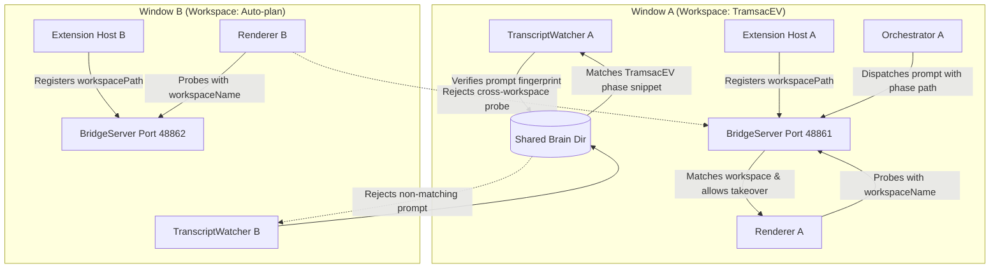

# Plan: Multi-Window Isolation & Prompt Fingerprint Verification

Created: 2026-09-04 10:30:00 UTC+7  
Status: 🟢 Completed  
Target Scope: Multi-Window Workspace-Bound Port Registry, Graceful Dynamic Window Rebind, Transcript Prompt Fingerprint Verification, and Cross-Window Hijack Prevention

---

## 1. Executive Summary & Root Cause Analysis

Recent live execution diagnostics revealed two critical cross-talk failures during multi-window operation:

1. **Orphaned Window Key & 409 Probe Rejection (LOGIC-002)**:
   - In `src/bridgeServer.ts`, when a window is reloaded or refreshed, Electron Renderer boots with a new `windowKey` (e.g. `dom_win_1788491912881_...`).
   - Because `BridgeServer` retained the prior `activeWindowKey` from before the reload, incoming discovery probes were rejected with HTTP 409 (`status: occupied`, `owner-mismatch`).
   - Consequently, the reloaded window failed to connect to its bridge server, leaving the input box completely blank while dispatched prompts were directed into a non-existent or stale client.

2. **Cross-Workspace Conversation Hijacking (LOGIC-003)**:
   - In `src/transcriptWatcher.ts`, `getCandidateConversationsAsync` only filtered candidate conversation directories by `time > sinceTimestamp` within the shared global directory `~/.gemini/antigravity-ide/brain/`.
   - When another open VS Code window (or manual chat in a different workspace) touched a conversation after `phaseStartTime`, the Orchestrator mistakenly bound to that foreign conversation (e.g. binding to conversation `a7b4079a-3435-4561-a01b-cb10a532262d`).
   - This caused the UI to show `Running... (71.5s)` for a phase whose prompt was never actually typed into the target workspace chat panel.

---

## 2. Architectural Solution Overview

---

## 3. Phase Breakdown

| Phase | Title | Scope | Primary Verification Test |
|---|---|---|---|
| **01** | [Multi-Window Workspace-Bound Port Registry & Dynamic Window Rebind](./phase-01-multi-window-workspace-binding-and-rebind.md) | `src/bridgeServer.ts`, `media/autoplan-dom-bridge.js` | `src/test/phase01_multi_window_workspace_rebind.test.ts` |
| **02** | [Transcript Prompt Fingerprint & Workspace Ownership Verification](./phase-02-transcript-prompt-fingerprint-verification.md) | `src/transcriptWatcher.ts`, `src/orchestrator.ts` | `src/test/phase02_transcript_conversation_ownership.test.ts` |
| **03** | [End-to-End Multi-Window Resilience & Hijack Prevention](./phase-03-multi-window-resilient-e2e-integration.md) | Full Pipeline Integration | `src/test/phase03_multi_window_e2e_resilience.test.ts` |

---

## 4. Strict Execution Protocol

Per user specifications:
- All phase files are written in English.
- For each phase, add exactly one comprehensive file-based test to verify the core functionality of that phase after implementation.
- Do not create or run more than one test per phase.
- After completing each phase, run only that single test for verification.
- Then stop so the user can review.
- Once done, just say "done."
