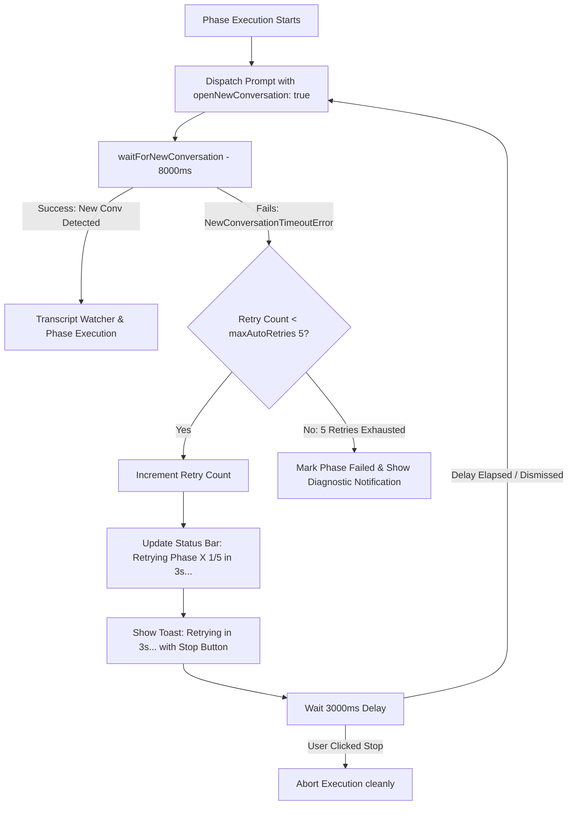

# Plan: Auto-Retry on NewConversationTimeoutError & Status Bar Cleanup

Created: 2026-09-04 14:30:00 UTC+7  
Status: 🟡 In Progress  
Target Scope: Resilient Auto-Retry Engine for NewConversationTimeoutError, 3s Countdown with User Cancellation, and Clean Status Bar Item Management

---

## 1. Executive Summary & Problem Context

During automated phase execution via DOM Bridge, when a new conversation is triggered, the chat input element or send button in Electron/React may briefly stay in a disabled state (`initialDisabled: true`, `cursor-not-allowed`). Although `enterKey` fallback is dispatched, the IDE chat backend may not immediately process the prompt, causing the Orchestrator to wait 8000ms and fail with:
```
NewConversationTimeoutError: Timeout waiting for new conversation after 8000ms. Verify prompt submission status in chat panel. (stale conversation: ...)
```

Currently, this immediately stops the entire automation sequence and prompts the user to click `🔄 Retry Failed Phase` manually. If unattended, the whole queue stalls indefinitely.

Furthermore, the secondary status bar item `🔌 Bridge: Active` is permanently visible on the bottom right of the IDE next to `Antigravity - Settings`, creating visual clutter since the primary `🚀 Auto-Plan` status bar already provides full status indicators and quick menus.

---

## 2. Architectural Solution Overview



---

## 3. Phase Breakdown

| Phase | Title | Scope | Primary Verification Test |
|---|---|---|---|
| **01** | [Configuration Schema & Status Bar Cleanup](./phase-01-config-and-statusbar-cleanup.md) | `package.json`, `src/config.ts`, `src/extension.ts` | `src/test/phase01_config_and_statusbar_cleanup.test.ts` |
| **02** | [Orchestrator Resilient Auto-Retry Engine](./phase-02-orchestrator-auto-retry-engine.md) | `src/orchestrator.ts` | `src/test/phase02_orchestrator_auto_retry_engine.test.ts` |
| **03** | [End-to-End Resilience & User Cancellation Integration](./phase-03-auto-retry-e2e-integration.md) | Full Pipeline Integration | `src/test/phase03_auto_retry_e2e_integration.test.ts` |

---

## 4. Strict Execution Protocol

Per user specifications:
- All phase files are written in English.
- For each phase, add exactly one comprehensive file-based test to verify the core functionality of that phase after implementation.
- Do not create or run more than one test per phase.
- After completing each phase, run only that single test for verification.
- Then stop so the user can review.
- Once done, just say "done."
