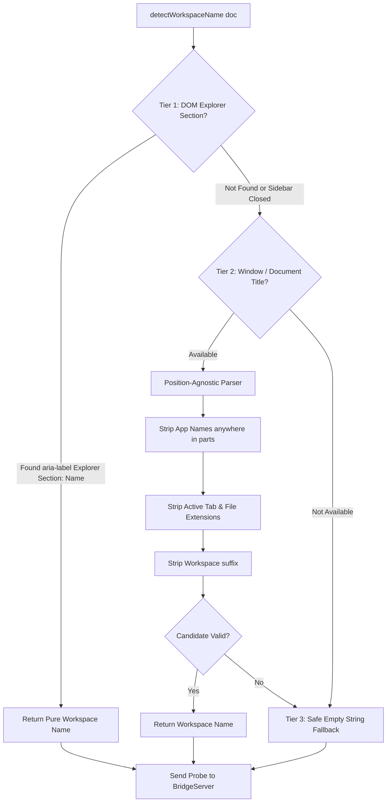

# Plan: Tiered DOM Bridge Workspace Detection

Created: 2026-09-06 16:20:00 UTC+7  
Status: ✅ Completed  
Target Scope: Client-side robust 3-tier workspace detection in `media/autoplan-dom-bridge.js` to eliminate false 409 workspace-mismatch probe rejections across Antigravity IDE and VS Code window layouts.

---

## 1. Executive Summary & Root Cause Analysis

During multi-phase plan automation, the DOM Bridge client failed to connect to `BridgeServer` on port 48860, resulting in `PREFLIGHT_TRANSPORT_FAILURE: Strict Tier 1 (DOM Bridge) requires active Electron bridge injection`.

Diagnostics revealed that:
1. In `media/autoplan-dom-bridge.js`, `detectWorkspaceName` called `parseWorkspaceFromTitleString` on `.window-title`.
2. In Antigravity IDE, the window title format is `[Workspace] - [AppName] - [ActiveFile]` (e.g. `Auto-plan-Extension-main - Antigravity IDE - body1.txt` or `EV-Plus-main - Antigravity IDE - phase-02-...md`).
3. The legacy title parser assumed VS Code's traditional format (`[ActiveFile] - [Workspace] - [AppName]`) and only stripped app names from the very end (`while (parts.length > 1) { parts.pop() }`). Because the active file was at the end, the loop popped nothing and picked the active file name as the workspace name.
4. When opening settings, the active editor became `"Auto-Plan Settings"`, causing the probe to request `workspaceName="Auto-Plan Settings"`.
5. The `BridgeServer` strictly validated `query.workspaceName !== this.workspaceName` and returned HTTP 409 (`workspace-mismatch`), locking out the client.

---

## 2. Architectural Solution Overview: 3-Tier Detection Strategy

- **Tier 1 (Direct DOM Explorer Extraction)**: Extract the exact workspace name from DOM elements like `[aria-label^="Explorer Section: "]` or `.pane-header` without string parsing.
- **Tier 2 (Position-Agnostic Title Parser)**: Parse `.window-title` or `document.title`, filtering out application names (`Antigravity IDE`, `Code`, `Cursor`) and active tab/file names regardless of whether they appear at the beginning, middle, or end.
- **Tier 3 (Safe Fallback)**: Return `""` if no valid workspace folder can be determined, avoiding sending misleading file or tab names that trigger 409 rejections.

---

## 3. Phase Breakdown

| Phase | Title | Scope | Primary Verification Test |
|---|---|---|---|
| **01** | [Tier 1 DOM Explorer Extraction & Active Tab Exclusion](./phase-01-tier1-dom-explorer-detection.md) | `media/autoplan-dom-bridge.js` | `src/test/phase01_tier1_explorer_workspace_detection.test.ts` |
| **02** | [Tier 2 Position-Agnostic Title Parser Resilience](./phase-02-tier2-title-parser-resilience.md) | `media/autoplan-dom-bridge.js` | `src/test/phase02_tier2_title_parser_resilience.test.ts` |
| **03** | [Tiered Workspace Detection End-to-End Integration](./phase-03-tiered-detection-e2e-integration.md) | `media/autoplan-dom-bridge.js` | `src/test/phase03_tiered_workspace_detection_e2e.test.ts` |

---

## 4. Strict Execution Protocol

Per user specifications:
- All phase files are written in English.
- For each phase, add detailed file-based tests to verify the functionality of each phase after completing that phase.
- Execute one phase at a time, verify with its test, and stop for user review.
- Once done, just say "Done." to save token.
