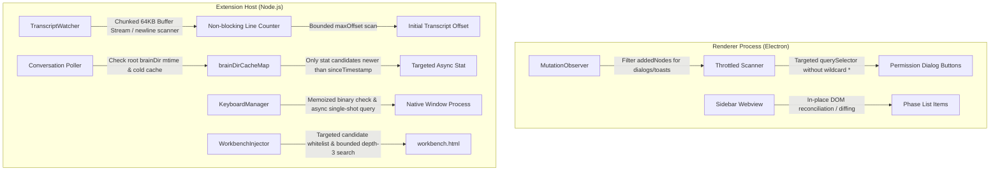

# Plan: Audit Performance Remediation (Critical & Warning Bottleneck Fixes)

Created: 2026-09-08 09:36:44 UTC+7  
Status: ⬜ Pending  
Target Scope: Remediate all 3 Critical Issues and 4 Warnings identified in the Performance Audit Report (`docs/reports/audit_2026-09-08_performance.md`) to eliminate Electron Renderer freezes, high CPU spikes, synchronous Extension Host blocking, disk I/O churn, and subprocess spawn latency.

---

## 1. Executive Summary & Root Cause Analysis

Diagnostics and comprehensive profiling from `docs/reports/audit_2026-09-08_performance.md` identified 7 performance bottlenecks across the extension stack:

1. **DOM Bridge Wildcard Scanning & Global MutationObserver (Critical 1 & Warning 4)**:
   - `MutationObserver` in `media/autoplan-dom-bridge.js` observes `document.body` with `{ subtree: true, childList: true }`. In VS Code, thousands of DOM nodes mutate constantly (cursor blink, typing, minimap, terminal output).
   - In `queryDeep()`, when searching elements, fallback execution runs `container.querySelectorAll('*')` iterating over every DOM element in the IDE window to inspect `shadowRoot` and `iframe`.
   - In `media/sidebar/sidebar.js`, `renderPhaseList` wipes out `phaseList.innerHTML = ''` on every state tick, causing UI flickering and Garbage Collection churn.

2. **Synchronous Transcript File Ingestion (Critical 2)**:
   - In `src/transcriptWatcher.ts` (`watchFile` and `switchActiveConversation`), `fs.readFileSync` reads multi-megabyte `transcript.jsonl` files (often 10MB–100MB+) entirely into memory, followed by synchronous `.split('\n')`.
   - This freezes the Node.js Extension Host main thread, triggering VS Code's *"Extension host is unresponsive"* warning.

3. **Disk I/O Polling Storm & Unused Brain Cache (Critical 3)**:
   - In `src/transcriptWatcher.ts`, `getCandidateConversationsAsync` executes repetitive `fs.promises.stat` calls across hundreds of conversation directories in `~/.gemini/antigravity-ide/brain/` every 300ms polling cycle.
   - `brainDirCacheMap` is declared but completely unused.
   - `initializeBaselineCandidates` runs synchronous `fs.readdirSync` and `fs.statSync` across all conversations during phase initialization.

4. **Synchronous Process Spawning & Deep Traversal Latency (Warnings 1, 2, 3)**:
   - In `src/keyboardManager.ts`, `inspectLinuxActiveWindow` executes 4 synchronous `execSync` processes sequentially.
   - `checkLinuxKeyboardPrerequisites` spawns `execSync('which xdotool')` on every readiness check without caching.
   - On Windows, `inspectWindowsActiveWindow` invokes PowerShell with inline C# `Add-Type` compilation, incurring 1.5s–2.5s JIT compiler overhead per call.
   - In `src/workbenchInjector.ts`, `findFileRecursive` performs an unconstrained synchronous depth-6 `readdirSync` traversal across the entire VS Code `out/` directory.

---

## 2. Architectural Solution Overview

---

## 3. Phase Breakdown

| Phase | Name | Target Files | Verification Test | Status |
|---|---|---|---|---|
| **01** | [DOM Bridge Scoping & Sidebar Render Optimization](./phase-01-dom-bridge-and-sidebar-render-scoping.md) | `media/autoplan-dom-bridge.js`, `media/sidebar/sidebar.js` | `src/test/phase01_dom_bridge_scoping_render_optimization.test.ts` | ✅ Completed |
| **02** | [Transcript Non-blocking Stream & Line Counter](./phase-02-transcript-nonblocking-stream-reader.md) | `src/transcriptWatcher.ts` | `src/test/phase02_transcript_stream_line_counter.test.ts` | ✅ Completed |
| **03** | [Brain Directory Cache & Bounded Polling I/O](./phase-03-brain-dir-cache-and-bounded-polling.md) | `src/transcriptWatcher.ts` | `src/test/phase03_brain_cache_bounded_polling.test.ts` | ✅ Completed |
| **04** | [Native Process Spawn & Traversal Optimization](./phase-04-process-spawn-and-workbench-traversal-optimization.md) | `src/keyboardManager.ts`, `src/workbenchInjector.ts` | `src/test/phase04_process_and_traversal_optimization.test.ts` | 0 Pending |

---

## 4. Strict Execution Protocol

Per repository standards and user instructions:
- All phase files are written in English.
- Implement each phase sequentially.
- For each phase, add exactly one comprehensive file-based test to verify the core functionality of that phase after implementation.
- Do not create or run more than one test per phase.
- After completing each phase, run **only** that designated single test for verification.
- Stop after each phase so the user can review before proceeding.
- Once done, just say "done."
