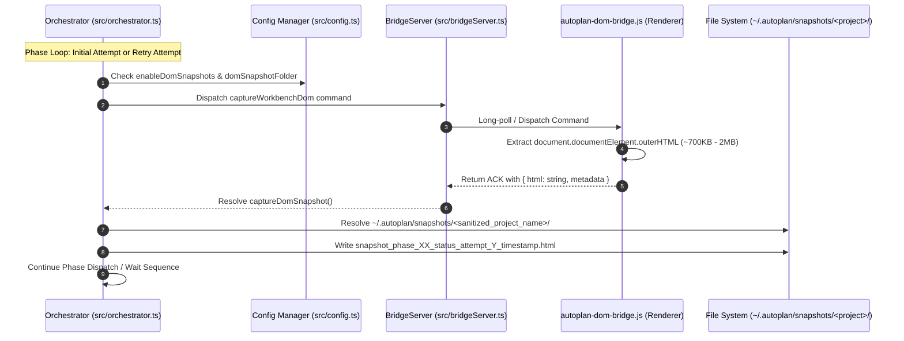

# Plan: Global DOM Snapshot Engine on Conversation Initialization and Retry

Created: 2026-09-09 08:15:00 UTC+7  
Status: 🟡 In Progress  
Target Scope: Automated Capture and Storage of Workbench DOM Snapshots (HTML) to Centralized Global Directory `~/.autoplan/snapshots/<project_name>/` during Conversation Initialization and Retries

---

## 1. Executive Summary & Problem Context

During automated test and phase runs across varied projects and workspaces, Antigravity IDE occasionally encounters transient UI desynchronization, modal dialogs, disabled send buttons, or new conversation creation timeouts. When investigating these failures or retries, developers previously had to manually dump the renderer DOM (such as `all2.txt`) through developer tools.

To eliminate manual intervention and provide deterministic diagnostic logs:
1. Every time a new conversation is initiated (both on the first attempt and on any retry attempt upon `NewConversationTimeoutError`), the extension must automatically capture the full workbench DOM HTML (`document.documentElement.outerHTML`).
2. Per user requirement (Option C), snapshots must be stored in a centralized **Global Directory** (`~/.autoplan/snapshots/<project_name>/`), completely isolated from the workspace source tree to ensure project codebases remain clean without untracked artifacts.
3. Because different VS Code windows open different projects, the engine must dynamically resolve the workspace name of the current window so that snapshots are neatly grouped by project without collisions.
4. The snapshot capture process must be resilient, non-blocking, and never interrupt or fail the core orchestrator automation loop if the DOM client temporarily disconnects.

---

## 2. Architectural Solution Overview

---

## 3. Phase Breakdown

| Phase | Title | Scope | Primary Verification Test |
|---|---|---|---|
| **01** | [DOM Bridge Capture Handler & BridgeServer Payload Streaming Protocol](./phase-01-dom-bridge-capture-and-bridgeserver.md) | `media/autoplan-dom-bridge.js`, `src/bridgeServer.ts` | `src/test/phase01_dom_bridge_capture_and_bridgeserver.test.ts` |
| **02** | [Configuration Schema & Global Directory Snapshot Storage Engine](./phase-02-config-and-global-snapshot-storage.md) | `package.json`, `src/config.ts`, `src/orchestrator.ts` | `src/test/phase02_config_and_global_snapshot_storage.test.ts` |
| **03** | [Orchestrator Pipeline Integration & Multi-Window E2E Verification](./phase-03-orchestrator-snapshot-pipeline-e2e.md) | `src/orchestrator.ts`, Full Pipeline Integration | `src/test/phase03_orchestrator_snapshot_pipeline_e2e.test.ts` |

---

## 4. Strict Execution Protocol

Per user specifications:
- All phase files are written in English.
- For each phase, add exactly one comprehensive file-based test to verify the core functionality of that phase after implementation.
- Do not create or run more than one test per phase.
- After completing each phase, run only that single test for verification.
- Then stop so the user can review.
- Once done, just say "done."
