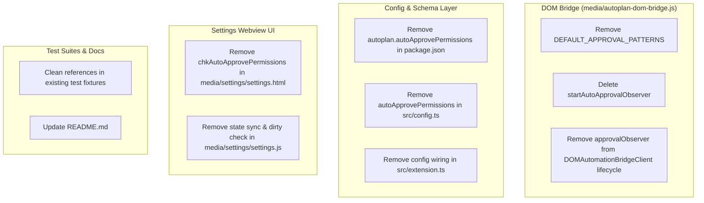

# Plan: Complete Removal of Auto-Approve Feature (Hard Delete)

Created: 2026-09-09 15:46:00 UTC+7  
Status: ✅ Completed  
Target Scope: Permanently eliminate the redundant Auto-Approve feature from the Auto-Plan Extension codebase across all layers (In-Process DOM Bridge, Extension Config Schema, Settings Webview UI, and Test Suites). This eliminates the PERF-01 finding (Layout Thrashing & Forced Reflow in Electron Renderer) while preventing race conditions with external dedicated approval extensions.

---

## 1. Executive Summary & Rationale

1. **Redundancy & Conflict Prevention**:
   - The user has a dedicated external extension for approving permissions which responds in ~1000ms with full coverage of dialog patterns.
   - Retaining the built-in auto-approver causes redundant DOM scanning, duplicate click event dispatches, and potential race conditions.

2. **Remediation of Clinical Audit Finding PERF-01**:
   - The built-in auto-approver in `media/autoplan-dom-bridge.js` was querying buttons globally across the IDE DOM and invoking `window.getComputedStyle` up ancestry trees at high frequency.
   - Deleting the auto-approver completely removes this computation loop, saving CPU cycles and preventing frame drops in VS Code.

3. **Complete Architectural Cleanliness**:
   - Hard Delete ensures no orphaned settings, dead DOM polling threads, or dangling schema properties remain in the repository.

---

## 2. Architectural Change Map

---

## 3. Phase Breakdown

| Phase | Name | Target Files | Verification Test | Status |
|---|---|---|---|---|
| **01** | [DOM Bridge Auto-Approver Removal](./phase-01-dom-bridge-removal.md) | `media/autoplan-dom-bridge.js` | `src/test/phase01_dom_bridge_auto_approve_removal.test.ts` | ✅ Completed |
| **02** | [Configuration & Schema Cleanup](./phase-02-config-and-schema-cleanup.md) | `package.json`, `src/config.ts`, `src/extension.ts`, `README.md` | `src/test/phase02_config_schema_auto_approve_removal.test.ts` | ✅ Completed |
| **03** | [Settings Webview UI Cleanup](./phase-03-settings-webview-cleanup.md) | `media/settings/settings.html`, `media/settings/settings.js` | `src/test/phase03_settings_webview_auto_approve_removal.test.ts` | ✅ Completed |
| **04** | [Test Suite Remediation & Global Regression Validation](./phase-04-test-suite-remediation-and-validation.md) | `src/test/*` | `src/test/phase04_auto_approve_removal_regression_validation.test.ts` | ✅ Completed |

---

## 4. Strict Execution Protocol

Per repository standards and user instructions:
- All phase files are written in English.
- Implement each phase sequentially.
- For each phase, add exactly one comprehensive file-based test to verify the core functionality of that phase after implementation.
- Do not create or run more than one test per phase.
- After completing each phase, run **only** that designated single test for verification.
- Stop after each phase so the user can review before proceeding.
- Once completely done, just say "done."
