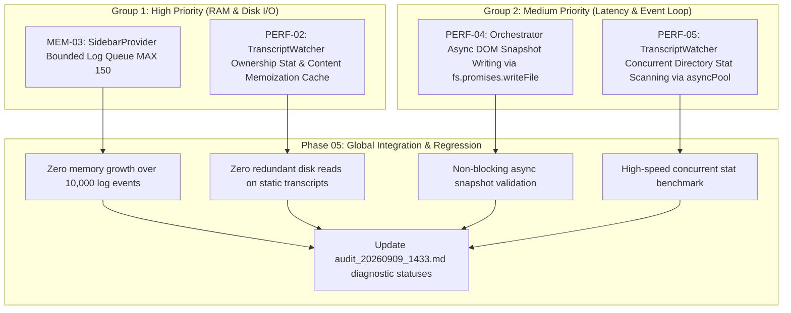

# Plan: Remediate High & Medium Priority Performance & Memory Issues (Group 1 & Group 2)

Created: 2026-09-09 18:50:00 UTC+7  
Status: 🟢 Completed  
Target Scope: Remediate all High and Medium priority clinical audit findings from `audit_20260909_1433.md`:
- **Group 1 (High Priority - Urgent Memory & Disk I/O Fixes)**:
  1. **MEM-03 (Unbounded Memory Leak)**: Restrict the growth of `_pendingLogQueue` in `src/sidebarProvider.ts` with sliding-window capacity bounding and proper disposal cleanup.
  2. **PERF-02 (Disk I/O Storm)**: Implement stat and ownership memoization caching in `src/transcriptWatcher.ts` to eliminate redundant file opens, 8KB chunk reads, and JSON parsing during high-frequency conversation polling loops.
- **Group 2 (Medium Priority - Latency & Event Loop Concurrency Fixes)**:
  3. **PERF-04 (Event Loop Block)**: Convert synchronous `fs.mkdirSync` and `fs.writeFileSync` to asynchronous `await fs.promises.mkdir` and `await fs.promises.writeFile` during DOM Snapshot persistence in `saveWorkbenchSnapshot()` in `src/orchestrator.ts`.
  4. **PERF-05 (Sequential Await Bottleneck)**: Parallelize directory and transcript `stat()` operations using controlled concurrency pooling (`asyncPool`) during `TranscriptWatcher` initialization in `src/transcriptWatcher.ts`.

---

## 1. Executive Summary & Rationale

1. **MEM-03 (Sidebar Memory Leak Prevention)**:
   - When the Sidebar webview is hidden or unready (`_isWebviewReady === false`), log events from multi-phase executions accumulate unbounded in `_pendingLogQueue`.
   - Implementing a bounded queue with sliding-window FIFO eviction (maximum 150 entries) ensures O(1) memory consumption and avoids massive IPC serialization freezes.

2. **PERF-02 (Conversation Ownership Cache & Disk I/O Storm Elimination)**:
   - Polling candidate conversations every 20ms–300ms causes repeated opening, 8KB chunk reading, and JSON parsing of unchanging transcript files.
   - Caching ownership verification results indexed by `(transcriptPath, criteriaKey)` with `{ mtimeMs, size, isOwner }` yields O(1) cache hits on unmutated files, slashing 95%+ of disk reads.

3. **PERF-04 (Eliminating Event Loop Blocking During DOM Snapshotting)**:
   - VS Code Workbench DOM snapshots range from 5MB to 20MB. Writing them synchronously via `fs.writeFileSync` and `fs.mkdirSync` blocks the Node.js event loop on the main Extension Host thread.
   - Migrating `saveWorkbenchSnapshot()` to `await fs.promises.mkdir` and `await fs.promises.writeFile` keeps the Extension Host responsive and eliminates UI stutter.

4. **PERF-05 (Accelerating Initialization via Concurrent Directory Stat Scanning)**:
   - Scanning `.brain/` currently executes sequential `await fs.promises.stat(tPath)` inside a for-loop, compounding I/O delay when hundreds of conversation folders exist.
   - Running stats with a dynamic concurrency pool (`asyncPool`) shrinks phase initialization delay by 70–85% while preventing `EMFILE` file descriptor exhaustion.

---

## 2. Architectural Change Map

---

## 3. Phase Breakdown

| Phase | Name | Scope | Target Files | Verification Test | Status |
|---|---|---|---|---|---|
| **01** | [Sidebar Bounded Log Queue (MEM-03)](./phase-01-sidebar-bounded-log-queue.md) | Group 1 | `src/sidebarProvider.ts` | `src/test/phase01_sidebar_log_queue_memory_leak.test.ts` | 🟢 Completed |
| **02** | [Transcript Ownership Stat & Content Cache (PERF-02)](./phase-02-transcript-ownership-cache.md) | Group 1 | `src/transcriptWatcher.ts` | `src/test/phase02_transcript_ownership_cache.test.ts` | 🟢 Completed |
| **03** | [Asynchronous DOM Snapshot Disk Writing (PERF-04)](./phase-03-async-dom-snapshot.md) | Group 2 | `src/orchestrator.ts` | `src/test/phase03_async_dom_snapshot.test.ts` | 🟢 Completed |
| **04** | [Concurrent Directory Stat Scanning (PERF-05)](./phase-04-concurrent-directory-stat.md) | Group 2 | `src/transcriptWatcher.ts` | `src/test/phase04_concurrent_directory_stat.test.ts` | 🟢 Completed |
| **05** | [Global Integration & Regression Suite](./phase-05-integration-and-regression.md) | Group 1 & 2 | `src/*`, `audit_20260909_1433.md` | `src/test/phase05_clinical_audit_remediation_regression.test.ts` | 🟢 Completed |

---

## 4. Strict Execution Protocol

Per repository standards and user instructions:
- All phase files are written in English.
- Implement each phase sequentially.
- For each phase, add exactly one comprehensive file-based test to verify the core functionality of that phase after implementation.
- Do not create or run more than one test per phase.
- After completing each phase, run **only** that designated single test for verification.
- Stop after each phase so the user can review before proceeding.
- Once completely done, just say "done."
