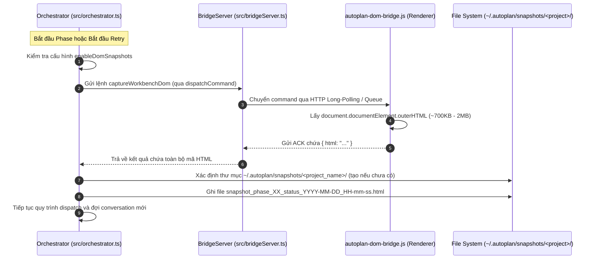

# Hướng Dẫn & Thiết Kế Kỹ Thuật: Tự Động Chụp DOM Snapshot Theo Timestamp (Global Folder)

Tài liệu này mô tả chi tiết phương án kiến trúc và các bước triển khai tính năng: **Tự động chụp và lưu toàn bộ DOM HTML của Antigravity Workbench (tương tự nội dung file `all2.txt`) mỗi khi tạo conversation mới (áp dụng cho cả lần chạy đầu tiên và mỗi lần retry).**

Theo yêu cầu của người dùng, toàn bộ các file snapshot sẽ được lưu tập trung tại thư mục **Global Folder** của máy tính (`~/.autoplan/snapshots/<tên_project>/`) nhằm đảm bảo:
- Source code của các project đang mở luôn sạch 100%, không bị sinh thêm file/folder rác trong workspace.
- Các cửa sổ (windows) khác nhau mở các project khác nhau sẽ tự động lưu vào các thư mục con riêng biệt mang tên project đó.

---

## 1. Mục tiêu

1. **Ghi lại trạng thái DOM thực tế**: Mỗi khi extension chuẩn bị tạo một conversation mới hoặc khi gặp lỗi timeout cần thử lại (retry), toàn bộ HTML của cửa sổ Antigravity (`document.documentElement.outerHTML`) sẽ được chụp lại.
2. **Lưu file có Timestamp tại Global Directory**: Tự động sinh file `.html` vào thư mục `~/.autoplan/snapshots/<project_name>/` với định dạng tên chứa thứ tự Phase, trạng thái (`initial` hoặc `retry_X`) và mốc thời gian rõ ràng.
3. **Phân tách theo từng Project Window**: Khi mở nhiều window cho các project khác nhau, extension tự động lấy tên thư mục của workspace hiện tại để phân nhóm, không bị ghi đè hay lẫn lộn giữa các dự án.
4. **Phục vụ phân tích & Debug**: Dễ dàng kiểm tra các lỗi giao diện như: Antigravity chưa kịp đóng hội thoại cũ, nút Send bị disable, xuất hiện popup rate limit, hoặc mất kết nối chat.
5. **Không làm gián đoạn luồng chính**: Quá trình chụp diễn ra bất đồng bộ và có cơ chế fallback (nếu chụp thất bại, luồng dispatch của phase vẫn tiếp tục bình thường).

---

## 2. Luồng Hoạt Động (Architecture Flow)



---

## 3. Các Bước Triển Khai Chi Tiết Từng File

### Bước 1: Thêm Command Handler trong `media/autoplan-dom-bridge.js`

Script này chạy trực tiếp trong tiến trình Renderer của Antigravity IDE, có quyền truy cập vào biến toàn cục `document` và `window`.

**Chi tiết sửa đổi trong hàm `handleCommand(cmd)` (khoảng dòng 3030 - 3045):**

```javascript
// media/autoplan-dom-bridge.js
} else if (cmd.type === 'captureWorkbenchDom') {
  try {
    const doc = this.customDocument || (typeof document !== 'undefined' ? document : null);
    if (!doc || !doc.documentElement) {
      throw new Error('Document root not accessible in current context');
    }
    const fullHtml = doc.documentElement.outerHTML || '';
    await this.sendAck(cmd.id, 'completed', null, { 
      html: fullHtml,
      byteLength: fullHtml.length,
      url: (typeof window !== 'undefined' && window.location) ? window.location.href : '',
      timestamp: Date.now()
    });
  } catch (snapErr) {
    logBridge('WARN', `Failed to capture DOM snapshot: ${snapErr?.message || snapErr}`, {}, snapErr);
    await this.sendAck(cmd.id, 'error', snapErr?.message || String(snapErr));
  }
}
```

---

### Bước 2: Nâng Cấp Giới Hạn Payload & Bổ Sung Helper trong `src/bridgeServer.ts`

#### 2.1. Nâng giới hạn kích thước nhận dữ liệu (Payload Size Limit)
Hiện tại ở dòng 1033 của `src/bridgeServer.ts`:
```typescript
if (body.length > 1024 * 1024) { // Hiện chỉ cho phép tối đa 1MB
  req.destroy();
}
```
File snapshot như `all2.txt` nặng từ 700KB đến 2MB (hoặc lớn hơn nếu có nhiều tin nhắn). Do đó **phải nâng giới hạn này lên tối thiểu 20MB** để tránh kết nối bị ngắt:
```typescript
const MAX_PAYLOAD_BYTES = 20 * 1024 * 1024; // 20 MB
if (body.length > MAX_PAYLOAD_BYTES) {
  this.logger.warn('SERVER', `Payload exceeded safety limit (${body.length} bytes), aborting request`);
  req.destroy();
}
```

#### 2.2. Bổ sung method `captureDomSnapshot()` vào class `BridgeServer`
```typescript
// src/bridgeServer.ts
public async captureDomSnapshot(timeoutMs: number = 8000): Promise<{ success: boolean; html?: string; error?: string }> {
  if (!this.isListening() || this.getConnectedClients().length === 0) {
    return { success: false, error: 'No active DOM Bridge client connected' };
  }

  try {
    const ackResult = await this.dispatchPromptCommand('', {
      type: 'captureWorkbenchDom',
      timeoutMs
    });

    if (ackResult.success && ackResult.metadata && typeof ackResult.metadata.html === 'string') {
      return { success: true, html: ackResult.metadata.html };
    }
    return { success: false, error: ackResult.error || 'Empty HTML returned from DOM Bridge' };
  } catch (err: any) {
    return { success: false, error: err.message || String(err) };
  }
}
```

---

### Bước 3: Tích Hợp Chụp & Ghi File Vào Global Directory trong `src/orchestrator.ts`

#### 3.1. Tạo Helper `saveWorkbenchSnapshot`
Hàm helper trong `Orchestrator` sẽ tự động xác định tên workspace hiện tại của window và lưu vào `~/.autoplan/snapshots/<project_name>/`:

```typescript
// src/orchestrator.ts
import * as os from 'os';

private async saveWorkbenchSnapshot(options: {
  phaseIndex: number;
  phaseName: string;
  attempt: number;
  triggerType: 'initial' | 'retry';
}): Promise<string | undefined> {
  const cfg = getConfig();
  if (cfg.enableDomSnapshots === false) {
    return undefined;
  }

  try {
    // 1. Xác định tên Project của window hiện tại
    const activeWsFolder = vscode?.workspace?.workspaceFolders?.[0];
    const wsName = this.workspaceName || 
      (activeWsFolder ? activeWsFolder.name : undefined) ||
      (this.workspacePath ? path.basename(this.workspacePath) : 'default_project');
    const sanitizedWsName = wsName.replace(/[^a-zA-Z0-9_-]/g, '_');

    // 2. Xác định thư mục Global: ~/.autoplan/snapshots/<sanitizedWsName>
    const homeDir = os.homedir();
    const baseSnapshotDir = cfg.domSnapshotFolder && path.isAbsolute(cfg.domSnapshotFolder)
      ? cfg.domSnapshotFolder
      : path.join(homeDir, '.autoplan', 'snapshots');

    const targetDir = path.join(baseSnapshotDir, sanitizedWsName);

    if (!fs.existsSync(targetDir)) {
      fs.mkdirSync(targetDir, { recursive: true });
    }

    // 3. Định dạng timestamp: YYYY-MM-DD_HH-mm-ss
    const now = new Date();
    const pad = (n: number) => String(n).padStart(2, '0');
    const timestampStr = `${now.getFullYear()}-${pad(now.getMonth() + 1)}-${pad(now.getDate())}_${pad(now.getHours())}-${pad(now.getMinutes())}-${pad(now.getSeconds())}`;

    const cleanPhaseName = options.phaseName.replace(/[^a-zA-Z0-9_-]/g, '_');
    const fileName = `snapshot_phase_${pad(options.phaseIndex + 1)}_${options.triggerType}_attempt_${options.attempt}_${timestampStr}.html`;
    const fullPath = path.join(targetDir, fileName);

    const bridgeServer = this.promptDispatcher.getBridgeServer();
    if (!bridgeServer) {
      return undefined;
    }

    // 4. Kéo HTML từ DOM Bridge và ghi file
    const res = await bridgeServer.captureDomSnapshot(6000);
    if (res.success && res.html) {
      fs.writeFileSync(fullPath, res.html, 'utf8');
      this.debugLogger.info(
        'ORCHESTRATOR',
        `[DOM-SNAPSHOT] Saved workbench snapshot to ${fullPath} (${(res.html.length / 1024).toFixed(1)} KB)`
      );
      return fullPath;
    }
  } catch (snapshotErr: any) {
    this.debugLogger.warn('ORCHESTRATOR', `Failed to capture DOM snapshot: ${snapshotErr?.message || snapshotErr}`);
  }
  return undefined;
}
```

#### 3.2. Kích hoạt trong vòng lặp Phase (Dòng ~1090)

**1. Chụp cho lần tạo đầu tiên (Initial Attempt):**
Ngay trước khi gửi dispatch prompt:
```typescript
// Trước dòng 1098: this.setState('sending', ...)
if (phaseRetryCount === 0) {
  await this.saveWorkbenchSnapshot({
    phaseIndex: i,
    phaseName: phase.fileName,
    attempt: 1,
    triggerType: 'initial'
  });
}
```

**2. Chụp cho mỗi lần Retry (Retry Attempt):**
Ngay khi bắt được `NewConversationTimeoutError` (trong block `if (phaseRetryCount < maxRetries)`, khoảng dòng 1232):
```typescript
if (err instanceof NewConversationTimeoutError) {
  if (phaseRetryCount < maxRetries) {
    phaseRetryCount++;
    this.stopStallWatchdog();

    // 📸 Chụp ngay snapshot khi xảy ra timeout tạo conversation
    await this.saveWorkbenchSnapshot({
      phaseIndex: i,
      phaseName: phase.fileName,
      attempt: phaseRetryCount,
      triggerType: 'retry'
    });

    const retryStatusMessage = `Auto-Plan: Retrying Phase ${phase.phaseNumber || i + 1} (${phaseRetryCount}/${maxRetries}) in ${retryDelaySeconds}s...`;
    // ... tiếp tục đếm ngược và retry
```

---

### Bước 4: Khai Báo Cấu Hình trong `package.json` & `src/config.ts`

Để người dùng có thể linh hoạt bật/tắt hoặc tùy biến thư mục lưu snapshot:

1. **Trong `package.json`**:
```json
"autoplan.enableDomSnapshots": {
  "type": "boolean",
  "default": true,
  "description": "Tự động chụp DOM HTML snapshot mỗi khi tạo hoặc retry conversation mới"
},
"autoplan.domSnapshotFolder": {
  "type": "string",
  "default": "",
  "description": "Đường dẫn tùy biến cho thư mục snapshots (để trống để mặc định lưu vào ~/.autoplan/snapshots/<project_name>)"
}
```

2. **Trong `src/config.ts`**:
Cập nhật interface `AutoPlanConfig` và `DEFAULT_CONFIG` để đọc 2 trường này.

---

## 4. Cấu Trúc File Lưu Trữ Thực Tế Trên Máy

Khi bạn mở nhiều cửa sổ VS Code cho nhiều dự án khác nhau:
```text
~/.autoplan/snapshots/
├── Auto-plan-Extension-main/
│   ├── snapshot_phase_01_initial_attempt_1_2026-09-09_08-10-00.html
│   ├── snapshot_phase_01_retry_attempt_1_2026-09-09_08-10-12.html
│   └── snapshot_phase_02_initial_attempt_1_2026-09-09_08-12-05.html
├── My-Web-App/
│   ├── snapshot_phase_01_initial_attempt_1_2026-09-09_09-00-00.html
│   └── snapshot_phase_01_retry_attempt_1_2026-09-09_09-00-15.html
└── Another-Backend-Service/
    └── snapshot_phase_01_initial_attempt_1_2026-09-09_10-15-30.html
```

* **Mã nguồn dự án**: Không bị thêm bất kỳ file/folder mới nào.
* **Tự động phân loại**: Snapshot của dự án nào sẽ nằm gọn trong thư mục mang tên dự án đó.
* **Nội dung file**: Giữ nguyên vẹn 100% cây DOM HTML của Antigravity (như file `all2.txt`).

---

## 5. Kế Hoạch Kiểm Thử (Verification Plan)

1. **Unit Test**: 
   - Viết test cho `BridgeServer.captureDomSnapshot` với mock response HTML lớn (>1MB) nhằm xác minh payload limit 20MB không bị lỗi.
   - Viết test cho logic tạo đường dẫn thư mục `~/.autoplan/snapshots/<sanitizedWsName>`.
2. **Integration Test**: 
   - Kiểm tra khi kích hoạt Phase (lần đầu và retry), helper `saveWorkbenchSnapshot` ghi file chính xác vào thư mục Global.
3. **Regression Test**: 
   - Đảm bảo nếu client DOM Bridge ngắt kết nối hoặc không phản hồi trong 6s, Orchestrator chỉ ghi log cảnh báo và tiếp tục chu trình bình thường, không crash luồng chạy.
