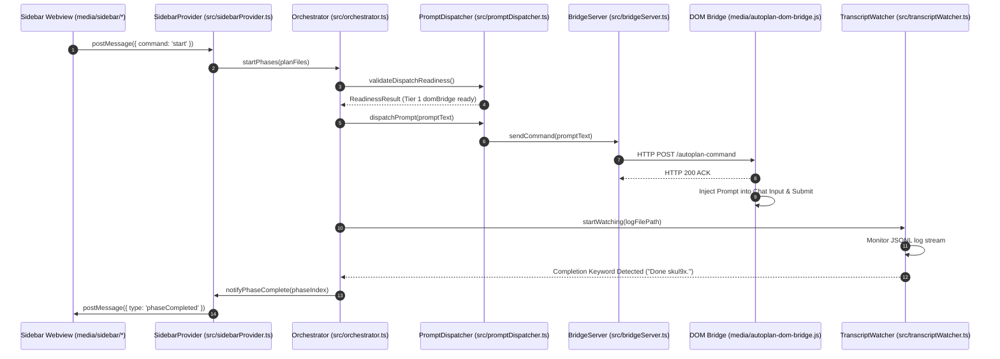

# Project Structure

This document provides a comprehensive architectural blueprint and directory structure reference for the Antigravity Auto-Plan Runner extension.

```
Auto-plan-Extension-main/
├── .brain/                         # AI assistant memory and conversation transcripts
├── docs/                           # Documentation and guides
├── media/                          # UI resources and DOM injection scripts
│   ├── autoplan-dom-bridge.js      # Renderer DOM injection script for direct chat control
│   ├── icon.svg                    # Extension sidebar icon
│   └── sidebar/                    # Control Center Webview UI
│       ├── sidebar.css             # Webview styling and design system
│       ├── sidebar.html            # Webview layout markup
│       └── sidebar.js              # Client-side webview IPC controller
├── out/                            # Compiled JavaScript output directory
├── plans/                          # Execution plans and phase specifications
└── src/                            # Extension source code
    ├── bridgeServer.ts             # Local HTTP IPC server for DOM bridge communication
    ├── config.ts                   # Configuration manager and workspace settings reader
    ├── extension.ts                # Activation entrypoint & command registration
    ├── keyboardManager.ts          # Cross-platform keyboard simulation fallback
    ├── orchestrator.ts             # Core plan execution engine & state machine
    ├── planScanner.ts              # Natural sorting and plan status parser
    ├── promptDispatcher.ts         # 3-Tier prompt delivery transport system
    ├── sidebarProvider.ts          # WebviewViewProvider for VS Code sidebar
    ├── transcriptWatcher.ts        # Log watcher & completion detection engine
    ├── workbenchInjector.ts        # Workbench HTML script tag injector
    └── test/                       # Verification test suites
        ├── phase01_structure_documentation.test.ts
        └── ...
```

---

## Core Modules

### 1. `src/extension.ts`
- **Responsibilities:**
  - Main extension activation (`activate`) and deactivation entrypoint.
  - Registers all VS Code commands (`autoplan.start`, `autoplan.stop`, `autoplan.skipPhase`, `autoplan.oneClickSetup`, etc.).
  - Manages status bar item lifecycle and visual state transitions.
  - Handles diagnostic dialogs, notification popups, and user interaction menus.

### 2. `src/orchestrator.ts`
- **Responsibilities:**
  - Sequential phase execution loop engine and central state machine (`idle`, `running`, `paused`, `completed`, `error`).
  - Manages inter-phase delays, timeout counters, retry logic, and cancellation/skip flows.
  - Coordinates `planScanner`, `promptDispatcher`, and `transcriptWatcher` during execution cycles.

### 3. `src/promptDispatcher.ts`
- **Responsibilities:**
  - 3-Tier fallback dispatcher for dispatching prompts to the Antigravity chat interface:
    - **Tier 1 (`domBridge`):** Focus-free HTTP IPC directly into `autoplan-dom-bridge.js`.
    - **Tier 2 (`nativeCommand`):** VS Code Command API dispatch (`workbench.action.chat.open`).
    - **Tier 3 (`keyboard`):** OS-level keyboard automation fallback (xdotool / PowerShell / AppleScript).
  - Performs zero-timeout fail-fast pre-flight readiness checks prior to phase execution.

### 4. `src/bridgeServer.ts`
- **Responsibilities:**
  - Local HTTP server listening on dynamic port range (ports 48860–48900).
  - Maintains client heartbeat registry, command queues, and ACK handling.
  - Writes active port and window registration info to global port registry file (`ag-autoplan-ports.json`).

### 5. `src/transcriptWatcher.ts`
- **Responsibilities:**
  - Non-blocking JSONL log stream watcher monitoring Antigravity chat transcript logs.
  - Enforces root mtime guards to detect active conversation files.
  - Implements debounce quiet-period detection to verify model completion tokens (e.g. `Done skul9x.`).

### 6. `src/workbenchInjector.ts`
- **Responsibilities:**
  - Elevation-capable HTML tag injector using system elevation tools (`pkexec`, `sudo`, `runAs`, `osascript`).
  - Manages `workbench.html` backup creation and restoration flows.
  - Automatically updates VS Code / Antigravity product checksums (`product.json`) to prevent corrupted installation alerts.

### 7. `src/planScanner.ts`
- **Responsibilities:**
  - Scans workspace `plans/` directory for phase plan markdown files.
  - Enforces natural alphanumeric sorting (e.g. `phase-01`, `phase-02`, ..., `phase-10`).
  - Applies blacklist filtering and detects completion status headers (`Status: ✅ Completed` vs `Status: ⬜ Pending`).

### 8. `src/sidebarProvider.ts`
- **Responsibilities:**
  - Implements `vscode.WebviewViewProvider` to render the sidebar dashboard.
  - Handles bidirectional IPC message routing between VS Code extension host and Webview context.
  - Synchronizes real-time state changes, phase progress, and execution logs to the dashboard.

### 9. `media/autoplan-dom-bridge.js`
- **Responsibilities:**
  - Injected renderer DOM script running inside VS Code / Antigravity workbench window.
  - Locates chat input DOM elements and injects prompts safely.
  - Executes double-tap submission sequence to dispatch prompts.
  - Observes and automatically approves modal permissions / execution dialogs.

### 10. `media/sidebar/*` (`media/sidebar/sidebar.html`, `media/sidebar/sidebar.css`, `media/sidebar/sidebar.js`)
- **Responsibilities:**
  - **`sidebar.html`:** Layout structure for the Auto-Plan Control Center webview.
  - **`sidebar.css`:** Modern theme-aware CSS styles and UI state indicators.
  - **`sidebar.js`:** Client-side JavaScript handling UI event listeners, button clicks, and messaging to `sidebarProvider`.

---

## Data Flow Diagram



---

## IPC Protocols

### 1. DOM Bridge HTTP IPC Protocol (`src/bridgeServer.ts` <-> `media/autoplan-dom-bridge.js`)
- **Port Discovery:**
  - `BridgeServer` picks an available port between `48860` and `48900`.
  - Registration is published in `~/.gemini/antigravity/ag-autoplan-ports.json`.
- **Endpoints:**
  - `GET /autoplan-status`: Client heartbeat check. Returns active server state and configuration.
  - `GET /autoplan-command`: Polled by `autoplan-dom-bridge.js` to retrieve queued prompt injection tasks.
  - `POST /autoplan-ack`: Called by `autoplan-dom-bridge.js` to send execution feedback and completion status.

### 2. Sidebar Webview IPC Protocol (`src/sidebarProvider.ts` <-> `media/sidebar/sidebar.js`)
- **Extension Host -> Webview:**
  - `webview.postMessage({ type: 'stateUpdate', data: { status, activePhase, planList } })`
  - `webview.postMessage({ type: 'log', message: string })`
- **Webview -> Extension Host:**
  - `vscode.postMessage({ command: 'start' })`
  - `vscode.postMessage({ command: 'stop' })`
  - `vscode.postMessage({ command: 'skipPhase' })`
  - `vscode.postMessage({ command: 'oneClickSetup' })`
