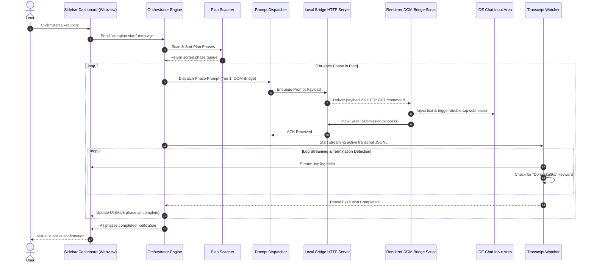

# Project Structure & Architecture Reference

## Directory Hierarchy

Below is the complete project directory tree mapping all source code modules, media UI assets, configuration, documentation, and operational folders:

```
Auto-plan-Extension/
├── .brain/                         # Project metadata, eternal memory, and task states
├── docs/                           # Extended documentation, RFCs, and release specs
├── media/                          # Webview front-end assets and injected DOM bridge scripts
│   ├── autoplan-dom-bridge.js      # Injected renderer DOM bridge (IPC client & observer)
│   ├── icon.svg                    # Extension icon graphic
│   ├── settings/                   # Settings webview UI dashboard
│   │   ├── settings.css            # Stylesheet supporting VS Code light/dark/high-contrast themes
│   │   ├── settings.html           # HTML UI layout for settings dashboard
│   │   └── settings.js             # Client-side settings controller and message bridge
│   └── sidebar/                    # Sidebar Activity Bar webview dashboard
│       ├── sidebar.css             # Dashboard responsive styling
│       ├── sidebar.html            # HTML structure for phase execution and log streamer
│       └── sidebar.js              # Client-side UI state manager and transcript visualizer
├── out/                            # Compiled JavaScript distribution artifacts (from tsc)
├── plans/                          # Execution plans and phase specifications
├── src/                            # TypeScript source codebase
│   ├── bridgeServer.ts             # Embedded HTTP REST IPC server for DOM bridge communication
│   ├── config.ts                   # Centralized typed configuration reader and defaults
│   ├── debugLogger.ts              # Diagnostic logging subsystem with rolling log buffer
│   ├── extension.ts                # Extension activation entrypoint, status bar, and command routing
│   ├── keyboardManager.ts          # Cross-platform OS-level synthetic keyboard dispatcher (Tier 3)
│   ├── orchestrator.ts             # Sequential phase execution engine and state machine
│   ├── planScanner.ts              # Plan discovery engine with alphanumeric natural sorting
│   ├── promptDispatcher.ts         # 3-Tier resilient prompt dispatch and fallback coordinator
│   ├── settingsProvider.ts         # Webview panel provider for visual settings management
│   ├── sidebarProvider.ts          # WebviewViewProvider for Sidebar Activity Bar dashboard
│   ├── transcriptWatcher.ts        # Non-blocking JSONL log streaming and keyword detector
│   ├── workbenchInjector.ts        # Privileged workbench.html injector and integrity manager
│   └── test/                       # Automated test suites and regression verification
├── package.json                    # Extension manifest, commands, settings schema, and dependencies
├── tsconfig.json                   # TypeScript compiler configuration
└── structure.md                    # Comprehensive architecture and codebase documentation
```

---

## Core Modules

### 1. `src/extension.ts` (Activation & Lifecycle Host)
- **Role:** Main VS Code extension entry point.
- **Key Responsibilities:**
  - Manages activation and deactivation lifecycles.
  - Registers the Status Bar Item (`🚀 Auto-Plan`) with dynamic state rendering (idle, running, paused).
  - Registers all 13 extension commands (e.g., `autoplan.start`, `autoplan.stop`, `autoplan.pause`, `autoplan.resume`, `autoplan.openSettings`, `autoplan.injectBridge`, `autoplan.exportDiagnostics`, etc.).
  - Initializes diagnostic health dialogs and environment validation routines.
  - Registers webview providers: `WebviewViewProvider` for sidebar and Webview panel for settings.

### 2. `src/orchestrator.ts` (Execution State Machine)
- **Role:** Phase execution engine and lifecycle controller.
- **Key Responsibilities:**
  - Manages sequential phase loops across discovered plan documents.
  - Implements a robust state machine (`IDLE`, `RUNNING`, `PAUSED`, `ERROR`, `COMPLETED`).
  - Controls inter-loop delays, configurable phase timeouts, and retry policies.
  - Handles real-time cancellation tokens and phase-skipping capabilities.

### 3. `src/promptDispatcher.ts` (3-Tier Dispatch & Fallback Engine)
- **Role:** Multi-tier prompt delivery coordinator ensuring 100% submission reliability.
- **Key Responsibilities:**
  - **Tier 1 (DOM Bridge HTTP IPC):** Dispatches prompt payloads to `bridgeServer.ts` which commands `media/autoplan-dom-bridge.js` injected inside the IDE workbench. Focus-free, zero-window-switching injection.
  - **Tier 2 (VS Code Command API):** Dispatches prompts using native VS Code / Antigravity editor commands.
  - **Tier 3 (OS Keyboard Simulation):** Fallback dispatching via synthetic keystroke injection via `src/keyboardManager.ts`.
  - Automatic tiered failover with configurable preference order and timeout escalation.

### 4. `src/settingsProvider.ts` (Visual Settings Management)
- **Role:** Controller for the dedicated Settings Webview Panel (`autoplan.openSettings`).
- **Key Responsibilities:**
  - Loads and renders `media/settings/settings.html`.
  - Provides intuitive UI controls for selecting dispatch tiers, retry intervals, log streaming debounces, and prompt formatting templates.
  - Maintains bi-directional synchronization with VS Code `workspace.getConfiguration('autoplan')`.

### 5. `src/sidebarProvider.ts` (Activity Bar Webview Container)
- **Role:** `WebviewViewProvider` implementation for the primary Activity Bar container (`autoplan.sidebarView`).
- **Key Responsibilities:**
  - Loads and manages `media/sidebar/sidebar.html`.
  - Houses the plan folder selector, active phase checklists, execution triggers, and real-time transcript streaming monitor.
  - Serves as the central IPC bridge between the extension backend and the frontend user interface.

### 6. `src/bridgeServer.ts` (Local HTTP IPC Gateway)
- **Role:** Lightweight local HTTP server facilitating bidirectional communication with the DOM bridge.
- **Key Responsibilities:**
  - Dynamically scans and binds to open ports within designated safe ranges (`48860-48900` / `49200-49220`).
  - Exposes REST endpoints:
    - `GET /health` — Service liveness and readiness probe.
    - `GET /command` — Command polling endpoint for the injected DOM script.
    - `POST /ack` — Acknowledgment and submission result reporting.
    - `GET /status` — Diagnostics and connection metadata inspection.
    - `POST /approval` — Auto-approval triggers and external command signals.
  - Writes ephemeral port registry files in the system temporary directory for discovery.

### 7. `src/transcriptWatcher.ts` (JSONL Conversation Log Streamer)
- **Role:** Real-time log file tracker and phase completion detector.
- **Key Responsibilities:**
  - Locates active Antigravity/Gemini conversation transcript JSONL log streams.
  - Employs non-blocking byte-offset streaming with root directory modification time (`mtime`) guards.
  - Analyzes incremental conversational chunks for termination signatures (such as `"Done skul9x."`).
  - Implements debounce quiet-period guards to confirm phase execution finality before triggering subsequent phases.

### 8. `src/workbenchInjector.ts` (Privileged Workbench Patching Engine)
- **Role:** Cross-platform script injection coordinator for VS Code's `workbench.html`.
- **Key Responsibilities:**
  - Locates the active installation path of `workbench.html`.
  - Handles security elevation across Windows (`runAs` PowerShell), Linux (`pkexec`), and macOS (`osascript`).
  - Injects `media/autoplan-dom-bridge.js` into the workbench document.
  - Maintains automated backups (`workbench.html.backup`) and handles clean uninstallation/restoration.
  - Updates product checksum manifests (`product.json`) to prevent corrupt installation warnings.

### 9. `src/planScanner.ts` (Plan Discovery & Natural Sorter)
- **Role:** Workspace file parser and phase dependency analyzer.
- **Key Responsibilities:**
  - Scans workspace directories (`plans/` or custom root) for Markdown phase plans.
  - Applies natural alphanumeric sorting (`phase-01`, `phase-02`, ..., `phase-10`).
  - Evaluates phase completion statuses (`[x] Completed`, `[ ] Pending`).
  - Filters out ignored directories and template files.

### 10. `src/keyboardManager.ts` (OS Keystroke Synthesizer)
- **Role:** Native OS keyboard automation provider for Tier 3 fallback.
- **Key Responsibilities:**
  - Cross-platform keyboard injection:
    - Windows: PowerShell `WScript.Shell` / `SendKeys`.
    - Linux: `xdotool`.
    - macOS: AppleScript / `osascript`.
  - System clipboard management, character escaping, and window focus retention strategies.

### 11. `src/config.ts` (Centralized Configuration Schema)
- **Role:** Strongly-typed wrapper around extension settings.
- **Key Responsibilities:**
  - Provides typed accessors and default values for all extension configurations (`tier`, `bridgePort`, `loopDelay`, `phaseTimeout`, `completionKeyword`, etc.).
  - Validates user configuration inputs with safe boundary fallbacks.

---

## Webview Assets & UI Panels

### 1. `media/autoplan-dom-bridge.js` (Renderer DOM Bridge Script)
- Injected directly into the IDE's Electron renderer process (`workbench.html`).
- Periodically polls `src/bridgeServer.ts` for pending dispatch actions.
- Traverses the IDE DOM to locate conversational input areas (ProseMirror / Lexical editors).
- Programmatically sets text contents and triggers double-tap Enter events without stealing editor focus.
- Observes DOM mutations for auto-approval modals and dismisses dialog confirmations when permitted.

### 2. `media/settings/settings.html` (Settings Webview Interface)
- Modern, clean settings interface rendered within a VS Code webview panel.
- Accompanied by `media/settings/settings.css` and `media/settings/settings.js`.
- Provides reactive controls for configuring tier strategies, timeouts, prompt templates, and ports with instant persistence.

### 3. `media/sidebar/sidebar.html` (Sidebar Dashboard View)
- Execution hub embedded within the VS Code Activity Bar (`autoplan.sidebarView`).
- Accompanied by `media/sidebar/sidebar.css` and `media/sidebar/sidebar.js`.
- Displays real-time phase execution progress, interactive run/pause/resume/stop controls, plan selection dropdowns, and streaming terminal-style log output.

---

## Data Flow & Architecture Diagrams

### Architectural Flow Overview

```
 +-----------------------------------------------------------------------------------+
 |                               VS Code Extension Host                              |
 |                                                                                   |
 |  +-----------------------+     Trigger      +----------------------------------+  |
 |  |  Sidebar / Commands   | ---------------> |         src/orchestrator.ts      |  |
 |  +-----------------------+                  +----------------------------------+  |
 |              |                                                |                   |
 |              | Reads Phases                                   | Dispatches Phase  |
 |              v                                                v                   |
 |  +-----------------------+                  +----------------------------------+  |
 |  |   src/planScanner.ts  |                  |     src/promptDispatcher.ts      |  |
 |  +-----------------------+                  +----------------------------------+  |
 |                                                               |                   |
 |              +------------------------------------------------+                   |
 |              |                               |                                    |
 |     (Tier 1: DOM Bridge)            (Tier 2: VS Code API)          (Tier 3: OS)   |
 |              v                               v                               v    |
 |  +-----------------------+          +-----------------+            +-----------+  |
 |  |  src/bridgeServer.ts  |          | VS Code Command |            |  Keyboard |  |
 |  +-----------------------+          +-----------------+            |  Manager  |  |
 |              ^                                                     +-----------+  |
 |              | HTTP REST IPC                                                      |
 +--------------|--------------------------------------------------------------------+
                v
 +-----------------------------------------------------------------------------------+
 |                            Electron Renderer / Webview                            |
 |                                                                                   |
 |   +------------------------------------+      Submits Text       +-------------+  |
 |   |    media/autoplan-dom-bridge.js    | ----------------------> | Chat Editor |  |
 |   +------------------------------------+ (Focus-Free Double-Tap) | Input (DOM) |  |
 |                                                                  +-------------+  |
 +-------------------------------------------------------------------------|---------+
                                                                           |
                                                                           | Produces
                                                                           v Logs
 +-----------------------------------------------------------------------------------+
 |                             Filesystem / Brain Storage                            |
 |                                                                                   |
 |   +------------------------------------+      Streams To         +-------------+  |
 |   |    src/transcriptWatcher.ts        | <---------------------- | JSONL Logs  |  |
 |   | (Detects "Done skul9x." Keyword)   |                         | Transcript  |  |
 |   +------------------------------------+                         +-------------+  |
 |                    |                                                              |
 |                    v Signals Phase Completion                                     |
 |   +------------------------------------+                                          |
 |   |  Orchestrator advances to next     |                                          |
 |   |  phase or completes run loop       |                                          |
 |   +------------------------------------+                                          |
 +-----------------------------------------------------------------------------------+
```

### Mermaid Sequence Diagram



---

## IPC Protocols & Communication Channels

### 1. Embedded Bridge Server REST API (`src/bridgeServer.ts`)
The extension hosts an embedded HTTP server bound to localhost on dynamically selected ports:

| Endpoint | Method | Payload / Parameters | Description |
| :--- | :---: | :--- | :--- |
| `/health` | `GET` | None | Validates server readiness and responsiveness. |
| `/command` | `GET` | Query token (optional) | Long-polling / fetch endpoint consumed by `autoplan-dom-bridge.js` to dequeue pending actions. |
| `/ack` | `POST` | `{ id: string, status: "ok" \| "error", message?: string }` | Sent by DOM Bridge to acknowledge successful input injection or report errors. |
| `/status` | `GET` | None | Returns active connection status, current queue depth, and server uptime. |
| `/approval`| `POST`| `{ action: "approve" \| "reject", promptId?: string }` | Handles external approval triggers and dialog confirmations. |

### 2. Webview Message Passing Protocol
Bidirectional JSON messaging channel between the VS Code extension host (`src/sidebarProvider.ts`, `src/settingsProvider.ts`) and the webview frontends (`media/sidebar/sidebar.js`, `media/settings/settings.js`):

#### Extension Host to Webview:
- `{ type: "stateUpdate", state: "idle" | "running" | "paused" | "error" }` — Updates overall run status.
- `{ type: "phaseList", phases: PhaseItem[] }` — Sends loaded plan phases with checked status.
- `{ type: "logStream", text: string, timestamp: number }` — Streams real-time transcript chunks.
- `{ type: "configLoaded", config: AutoplanConfig }` — Transmits active configuration properties.

#### Webview to Extension Host:
- `{ command: "start", selectedPhases?: string[] }` — Triggers orchestrator loop.
- `{ command: "pause" }` / `{ command: "resume" }` / `{ command: "stop" }` — Controls running execution.
- `{ command: "saveConfig", config: Partial<AutoplanConfig> }` — Persists updated settings.
- `{ command: "selectPlanFolder" }` — Prompts workspace folder selection dialog.
- `{ command: "injectBridge" }` — Triggers privileged workbench script injection.
